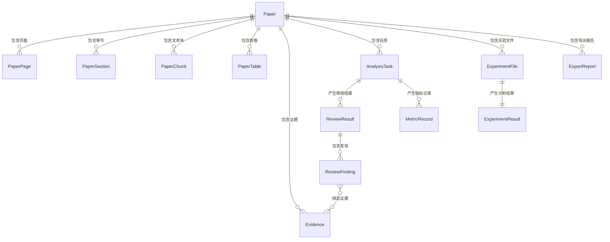

# 数据模型详细设计

## 文档信息

| 项目 | 内容 |
|------|------|
| 项目名称 | PaperLens |
| 文档版本 | v1.1 |
| 创建日期 | 2026-07-13 |
| 最后更新 | 2026-07-13 |

## 1. 概念模型 (ER 图)



## 2. 数据表定义

### 2.1 Paper (论文主表) ✅ 已实现

| 字段名 | 数据类型 | 约束 | 说明 |
|--------|----------|------|------|
| id | UUID | PK | 主键 |
| title | VARCHAR(500) | NOT NULL | 论文标题 |
| filename | VARCHAR(255) | NOT NULL | 原始文件名 |
| storage_key | VARCHAR(1024) | NOT NULL | 存储路径 papers/{paper_uuid}/source.pdf |
| file_size | BIGINT | NOT NULL | 文件大小（字节） |
| file_hash | VARCHAR(64) | NOT NULL | SHA-256 文件哈希 |
| page_count | INTEGER | | 页数 |
| status | VARCHAR(20) | NOT NULL | UPLOADING / PROCESSING / PARSED / FAILED |
| error_message | TEXT | | 解析失败时的错误信息 |
| user_id | VARCHAR(128) | NOT NULL | 所属用户 |
| created_at | TIMESTAMP | NOT NULL | 创建时间 |
| updated_at | TIMESTAMP | NOT NULL | 更新时间 |

**索引:**

```sql
CREATE INDEX idx_paper_user_id ON papers(user_id);
CREATE INDEX idx_paper_file_hash ON papers(file_hash);
CREATE INDEX idx_paper_status ON papers(status);
```

### 2.2 PaperPage (论文页面表) ✅ 已实现

| 字段名 | 数据类型 | 约束 | 说明 |
|--------|----------|------|------|
| id | UUID | PK | 主键 |
| paper_id | UUID | FK → Paper.id | 所属论文 |
| page_number | INTEGER | NOT NULL | 页码（从 1 开始） |
| text_content | TEXT | | 页面纯文本内容 |
| normalized_text_content | TEXT | | 页面归一化文本（空白字符合并） |
| width | FLOAT | | 页面宽度（pt） |
| height | FLOAT | | 页面高度（pt） |
| storage_key | VARCHAR(1024) | | 🔴 PLANNED：页面图片存储路径（预留，ORM 中未实现） |

**唯一约束:** `uq_paper_page UNIQUE (paper_id, page_number)`

### 2.3 PaperSection (论文章节表) ✅ 已实现

| 字段名 | 数据类型 | 约束 | 说明 |
|--------|----------|------|------|
| id | UUID | PK | 主键 |
| paper_id | UUID | FK → Paper.id | 所属论文 |
| section_type | VARCHAR(50) | NOT NULL | ABSTRACT / INTRODUCTION / METHOD / EXPERIMENT / RESULT / DISCUSSION / CONCLUSION / REFERENCES / APPENDIX / OTHER |
| title | VARCHAR(500) | | 章节标题 |
| level | INTEGER | NOT NULL DEFAULT 1 | 标题层级 |
| sequence | INTEGER | NOT NULL | 排序序号 |
| start_page | INTEGER | | 起始页码 |
| end_page | INTEGER | | 结束页码 |
| text_content | TEXT | | 章节正文内容 |

**索引:**

```sql
CREATE INDEX idx_paper_section_paper_id ON paper_sections(paper_id, sequence);
```

### 2.4 PaperChunk (文本分块表) ✅ 已实现

| 字段名 | 数据类型 | 约束 | 说明 |
|--------|----------|------|------|
| id | UUID | PK | 主键 |
| paper_id | UUID | FK → Paper.id | 所属论文 |
| section_id | UUID | FK → PaperSection.id | 所属章节 |
| chunk_index | INTEGER | NOT NULL | 块序号 |
| content | TEXT | NOT NULL | 块文本内容 |
| char_count | INTEGER | NOT NULL | 字符数 |
| page_numbers | INTEGER[] | | 涉及的页码列表 |
| embedding_id | VARCHAR(128) | | 向量索引中的 ID |

**唯一约束:** `uq_paper_chunk UNIQUE (paper_id, chunk_index)`

### 2.5 PaperTable (论文表格表) ✅ 已实现

| 字段名 | 数据类型 | 约束 | 说明 |
|--------|----------|------|------|
| id | UUID | PK | 主键 |
| paper_id | UUID | FK → Paper.id | 所属论文 |
| page_number | INTEGER | NOT NULL | 所在页码 |
| table_index | INTEGER | NOT NULL | 页内表格序号（从 1 开始） |
| caption | VARCHAR(500) | | 表格标题 |
| bbox_x0 | FLOAT | | 表格边界框左上角 X |
| bbox_y0 | FLOAT | | 表格边界框左上角 Y |
| bbox_x1 | FLOAT | | 表格边界框右下角 X |
| bbox_y1 | FLOAT | | 表格边界框右下角 Y |
| structured_data | JSONB | | 结构化表格数据（行列形式） |
| raw_text | TEXT | | 表格原始文本（兜底） |

**唯一约束:** `uq_paper_table UNIQUE (paper_id, page_number, table_index)`

### 2.6 Evidence (原文证据表) ✅ 已实现

| 字段名 | 数据类型 | 约束 | 说明 |
|--------|----------|------|------|
| id | UUID | PK | 主键 |
| paper_id | UUID | FK → Paper.id | 所属论文 |
| chunk_id | UUID | FK → PaperChunk.id | 来源文本块 |
| section_id | UUID | FK → PaperSection.id | 来源章节 |
| quoted_text | TEXT | NOT NULL | 证据原文引用文本 |
| page_number | INTEGER | NOT NULL | 所在页码 |
| bbox_x0 | FLOAT | | 证据区域左上角 X（pt） |
| bbox_y0 | FLOAT | | 证据区域左上角 Y（pt） |
| bbox_x1 | FLOAT | | 证据区域右下角 X（pt） |
| bbox_y1 | FLOAT | | 证据区域右下角 Y（pt） |
| char_start | INTEGER | | 在页面文本中的起始字符偏移 |
| char_end | INTEGER | | 在页面文本中的结束字符偏移 |
| evidence_type | VARCHAR(30) | NOT NULL | TEXT / TABLE / FIGURE_CAPTION / EQUATION |
| created_at | TIMESTAMP | NOT NULL | 创建时间 |

**索引:**

```sql
CREATE INDEX idx_evidence_paper_id ON evidences(paper_id);
CREATE INDEX idx_evidence_chunk_id ON evidences(chunk_id);
CREATE INDEX idx_evidence_page ON evidences(paper_id, page_number);
```

### 2.7 AnalysisTask (分析任务表) 📋 仅数据模型骨架（服务/API/前端未实现）

| 字段名 | 数据类型 | 约束 | 说明 |
|--------|----------|------|------|
| id | UUID | PK | 主键 |
| paper_id | UUID | FK → Paper.id | 关联论文 |
| task_type | VARCHAR(50) | NOT NULL | REVIEW / METRIC_EXTRACTION / EXPERIMENT_ANALYSIS |
| status | VARCHAR(20) | NOT NULL | PENDING / RUNNING / SUCCEEDED / FAILED / CANCELLED |
| progress | INTEGER | NOT NULL DEFAULT 0 | 进度百分比 0-100 |
| error_message | TEXT | | 失败原因 |
| started_at | TIMESTAMP | | 开始时间 |
| completed_at | TIMESTAMP | | 完成时间 |
| created_at | TIMESTAMP | NOT NULL | 创建时间 |
| user_id | VARCHAR(128) | NOT NULL | 发起用户 |

**索引:**

```sql
CREATE INDEX idx_task_paper_id ON analysis_tasks(paper_id);
CREATE INDEX idx_task_status ON analysis_tasks(status);
CREATE INDEX idx_task_user_id ON analysis_tasks(user_id);
```

### 2.8 ReviewResult (审阅结果表) 📋 仅数据模型骨架（服务/API/前端未实现）

| 字段名 | 数据类型 | 约束 | 说明 |
|--------|----------|------|------|
| id | UUID | PK | 主键 |
| task_id | UUID | FK → AnalysisTask.id | 关联任务 |
| paper_id | UUID | FK → Paper.id | 关联论文 |
| dimension | VARCHAR(50) | NOT NULL | SOUNDNESS / NOVELTY / CLARITY / COMPLETENESS / REPRODUCIBILITY / SIGNIFICANCE / OVERALL / OTHER |
| rating | INTEGER | | 评分 1-5 |
| summary | TEXT | | 该维度的总体评价 |
| overall_verdict | VARCHAR(20) | | ACCEPT / WEAK_ACCEPT / BORDERLINE / WEAK_REJECT / REJECT |
| created_at | TIMESTAMP | NOT NULL | 创建时间 |

**显式索引:**

```sql
CREATE INDEX idx_review_task_id ON review_results(task_id);
CREATE INDEX idx_review_paper_id ON review_results(paper_id);
```

**唯一约束:** `uq_review_dimension UNIQUE (task_id, dimension)`

### 2.9 ReviewFinding (审阅发现表) 📋 仅数据模型骨架（服务/API/前端未实现）

| 字段名 | 数据类型 | 约束 | 说明 |
|--------|----------|------|------|
| id | UUID | PK | 主键 |
| review_id | UUID | FK → ReviewResult.id | 所属审阅结果 |
| finding_type | VARCHAR(20) | NOT NULL | STRENGTH / WEAKNESS / SUGGESTION |
| content | TEXT | NOT NULL | 发现内容 |
| confidence | FLOAT | | 置信度 0.0-1.0 |
| verification_status | VARCHAR(20) | NOT NULL DEFAULT PENDING | VERIFIED / UNVERIFIED / PENDING |
| sequence | INTEGER | NOT NULL | 排序序号 |
| created_at | TIMESTAMP | NOT NULL | 创建时间 |

**索引:**

```sql
CREATE INDEX idx_finding_review_id ON review_findings(review_id, sequence);
CREATE INDEX idx_finding_type ON review_findings(review_id, finding_type);
```

### 2.10 finding_evidences (发现-证据关联表) 📋 仅数据模型骨架（服务/API/前端未实现）

| 字段名 | 数据类型 | 约束 | 说明 |
|--------|----------|------|------|
| finding_id | UUID | FK → ReviewFinding.id | 审阅发现 |
| evidence_id | UUID | FK → Evidence.id | 证据 |

**复合主键:** `PRIMARY KEY (finding_id, evidence_id)`。迁移中没有 `idx_finding_evidence`。

### 2.11 MetricRecord（实验指标记录表）✅ P4.1 后端已实现

| 字段名 | 数据类型 | 约束 | 说明 |
|--------|----------|------|------|
| id | UUID | PK | 主键 |
| paper_id | UUID | FK → Paper.id | 所属论文 |
| task_id | UUID | FK → AnalysisTask.id | 关联任务 |
| user_id | VARCHAR(128) | FK → User.id, NOT NULL | 真实资源所有者 |
| model_name | VARCHAR(200) | | 模型名称 |
| dataset_name | VARCHAR(200) | | 数据集名称 |
| metric_name | VARCHAR(100) | NOT NULL | 指标名称 |
| metric_value | FLOAT | NOT NULL | 指标值 |
| checkpoint_type | VARCHAR(20) | NOT NULL | FINAL / MAX / MEAN / BEST / LAST / UNKNOWN |
| checkpoint_source | VARCHAR(50) | | caption / row_header / context / conflict / null |
| evidence_id | UUID | FK → Evidence.id | 关联证据 |
| raw_text | TEXT | | 原始文本片段 |
| table_id | UUID | FK → PaperTable.id | 来源表格 |
| row_index | INTEGER | | 表格行号 |
| created_at | TIMESTAMP | NOT NULL | 创建时间 |

**索引:**

```sql
CREATE INDEX idx_metric_paper_id ON metric_records(paper_id);
CREATE INDEX idx_metric_task_id ON metric_records(task_id);
CREATE INDEX idx_metric_checkpoint_type ON metric_records(checkpoint_type);
CREATE INDEX idx_metric_user_id ON metric_records(user_id);
CREATE INDEX idx_metric_name ON metric_records(metric_name);
```

007 纠正迁移要求 metric_value 有限、Checkpoint 非空、表格行或 Evidence 来源二选一，并把来源外键改为 RESTRICT；活动 METRIC_EXTRACTION 任务另有用户+论文部分唯一索引。

### 2.12 ExperimentFile (实验数据文件表) ✅ P5.1 CURRENT

| 字段名 | 数据类型 | 约束 | 说明 |
|--------|----------|------|------|
| id | UUID | PK | 主键 |
| paper_id | UUID | FK → Paper.id | 关联论文 |
| filename | VARCHAR(255) | NOT NULL | 原始文件名 |
| storage_key | VARCHAR(1024) | NOT NULL | 存储路径 |
| file_size | BIGINT | NOT NULL | 文件大小 |
| file_hash | VARCHAR(64) | NOT NULL | SHA-256 哈希 |
| file_type | VARCHAR(10) | NOT NULL | CSV / XLSX / XLS |
| row_count | INTEGER | NOT NULL，1～100000 | 数据行数，不含表头 |
| column_count | INTEGER | NOT NULL，1～256 | 数据列数 |
| columns_info | JSONB | NOT NULL | version=1 严格结构元数据对象 |
| user_id | VARCHAR(128) | NOT NULL | 所属用户 |
| created_at | TIMESTAMP | NOT NULL | 创建时间 |

**索引:**

```sql
CREATE INDEX idx_exp_file_paper_id ON experiment_files(paper_id);
CREATE INDEX idx_exp_file_user_id ON experiment_files(user_id);
```

008 增加 `ck_exp_file_type_values`、`ck_exp_file_size_positive`、`ck_exp_file_hash_hex64`、`ck_exp_file_row_count_range`、`ck_exp_file_column_count_range` 和 `uq_exp_file_user_paper_hash(user_id, paper_id, file_hash)`。迁移只读预检已有冲突，发现不兼容数据立即中止，不 UPDATE/DELETE 用户数据。完整哈希和 storage_key 仅内部使用，不进入公开 API。

### 2.13 ExperimentResult (实验数据分析结果表) 📋 仅数据模型骨架（服务/API/前端未实现）

| 字段名 | 数据类型 | 约束 | 说明 |
|--------|----------|------|------|
| id | UUID | PK | 主键 |
| file_id | UUID | FK → ExperimentFile.id, UNIQUE | 关联文件 |
| task_id | UUID | FK → AnalysisTask.id | 关联任务 |
| summary_stats | JSONB | NOT NULL | 统计摘要 |
| column_analysis | JSONB | | 列级分析结果 |
| metric_comparisons | JSONB | | 与论文指标的对比结果 |
| created_at | TIMESTAMP | NOT NULL | 创建时间 |

**唯一约束:** `file_id UNIQUE`（`unique=True`，迁移中未显式命名）。迁移中没有 `idx_exp_result_file_id`。

### 2.14 ExportReport (导出报告表) 📋 仅数据模型骨架（服务/API/前端未实现）

| 字段名 | 数据类型 | 约束 | 说明 |
|--------|----------|------|------|
| id | UUID | PK | 主键 |
| paper_id | UUID | FK → Paper.id | 关联论文 |
| report_type | VARCHAR(20) | NOT NULL | MARKDOWN / PDF / DOCX |
| status | VARCHAR(20) | NOT NULL DEFAULT PENDING | PENDING / GENERATING / READY / FAILED |
| storage_key | VARCHAR(1024) | | 导出文件存储路径 |
| content_hash | VARCHAR(64) | | 内容哈希 |
| file_size | BIGINT | | 文件大小 |
| error_message | TEXT | | 失败原因 |
| user_id | VARCHAR(128) | NOT NULL | 所属用户 |
| created_at | TIMESTAMP | NOT NULL | 创建时间 |
| completed_at | TIMESTAMP | | 完成时间 |

**索引:**

```sql
CREATE INDEX idx_export_paper_id ON export_reports(paper_id);
CREATE INDEX idx_export_user_id ON export_reports(user_id);
CREATE INDEX idx_export_status ON export_reports(status);
```

## 3. 数据约束

### 3.1 CheckConstraints

| 约束名 | 表 | 约束描述 |
|--------|-----|----------|
| ck_paper_status_values | Paper | status IN ('UPLOADING', 'PROCESSING', 'PARSED', 'FAILED') |
| ck_paper_page_number_gte1 | PaperPage | page_number >= 1 |
| ck_paper_table_page_number_gte1 | PaperTable | page_number >= 1 |
| ck_paper_table_table_index_gte1 | PaperTable | table_index >= 1 |
| ck_paper_table_bbox_x_valid | PaperTable | bbox_x1 >= bbox_x0 |
| ck_paper_table_bbox_y_valid | PaperTable | bbox_y1 >= bbox_y0 |
| ck_evidence_page_number_gte1 | Evidence | page_number >= 1 |
| ck_evidence_char_start_gte0 | Evidence | char_start >= 0 |
| ck_evidence_char_end_gte_char_start | Evidence | char_end >= char_start |
| ck_evidence_bbox_x_valid | Evidence | bbox_x1 >= bbox_x0 |
| ck_evidence_bbox_y_valid | Evidence | bbox_y1 >= bbox_y0 |
| ck_evidence_type_values | Evidence | evidence_type IN ('TEXT', 'TABLE', 'FIGURE_CAPTION', 'EQUATION') |
| ck_analysis_task_status_values | AnalysisTask | status IN ('PENDING', 'RUNNING', 'SUCCEEDED', 'FAILED', 'CANCELLED') |
| ck_analysis_task_progress_range | AnalysisTask | progress BETWEEN 0 AND 100 |
| ck_review_rating_range | ReviewResult | rating BETWEEN 1 AND 5 |
| ck_finding_type_values | ReviewFinding | finding_type IN ('STRENGTH', 'WEAKNESS', 'SUGGESTION') |
| ck_finding_confidence_range | ReviewFinding | confidence BETWEEN 0 AND 1 |
| ck_verification_status_values | ReviewFinding | verification_status IN ('VERIFIED', 'UNVERIFIED', 'PENDING') |
| ck_exp_file_type_values | ExperimentFile | file_type IN ('CSV', 'XLSX', 'XLS') |
| ck_exp_file_size_positive | ExperimentFile | file_size > 0 |
| ck_exp_file_hash_hex64 | ExperimentFile | 64 个小写十六进制字符 |
| ck_exp_file_row_count_range | ExperimentFile | row_count BETWEEN 1 AND 100000 |
| ck_exp_file_column_count_range | ExperimentFile | column_count BETWEEN 1 AND 256 |
| ck_export_status_values | ExportReport | status IN ('PENDING', 'GENERATING', 'READY', 'FAILED') |

### 3.2 参照完整性

- PaperPage.paper_id → Paper.id
- PaperSection.paper_id → Paper.id
- PaperChunk.paper_id → Paper.id, PaperChunk.section_id → PaperSection.id
- PaperTable.paper_id → Paper.id
- Evidence.paper_id → Paper.id, Evidence.chunk_id → PaperChunk.id, Evidence.section_id → PaperSection.id
- AnalysisTask.paper_id → Paper.id
- ReviewResult.task_id → AnalysisTask.id, ReviewResult.paper_id → Paper.id
- ReviewFinding.review_id → ReviewResult.id
- finding_evidences.finding_id → ReviewFinding.id, finding_evidences.evidence_id → Evidence.id
- MetricRecord.paper_id → Paper.id, MetricRecord.task_id → AnalysisTask.id, MetricRecord.evidence_id → Evidence.id, MetricRecord.table_id → PaperTable.id
- ExperimentFile.paper_id → Paper.id
- ExperimentResult.file_id → ExperimentFile.id, ExperimentResult.task_id → AnalysisTask.id
- ExportReport.paper_id → Paper.id

## 4. 数据迁移

| 迁移 | 说明 |
|------|------|
| 001_initial | 创建 13 张业务表 + 1 张关联表 |
| 002_constraints | 新增 CheckConstraints |
| 003_normalized_and_error | 新增 normalized_text_content + error_message 字段 |
| 004～005 | 用户、会话和密码重置模型及无损完整性纠正 |
| 006～007 | 指标完整性及活动任务并发约束 |
| 008_experiment_file_integrity | ExperimentFile 非空/范围/CHECK/幂等唯一约束；冲突只读中止 |

---

**文档版本**: v1.2
**创建日期**: 2026-07-13
**最后更新**: 2026-07-14
