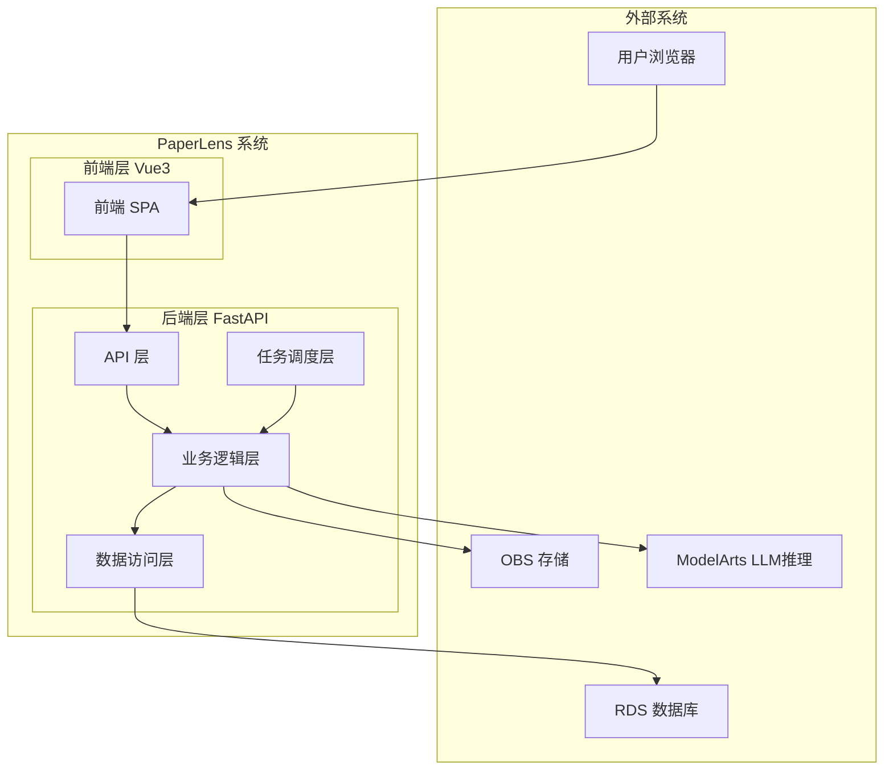
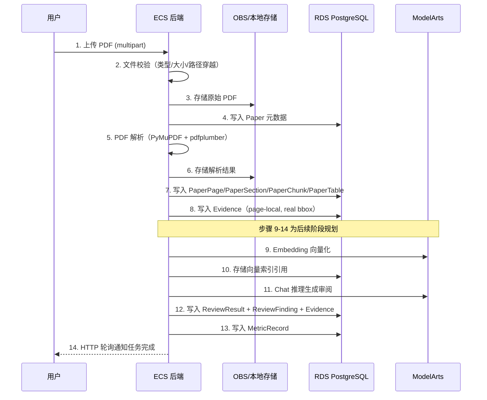

# PaperLens - 总设计文档

## 文档信息

| 项目 | 内容 |
|------|------|
| 项目名称 | PaperLens |
| 文档版本 | v1.1 |
| 创建日期 | 2026-07-13 |
| 最后更新 | 2026-07-15 |

## 1. 系统架构概览

### 1.1 架构图



### 1.2 技术栈

| 层次 | 技术选型 | 版本 | 说明 |
|------|----------|------|------|
| 前端框架 | Vue3 + TypeScript | 3.x | 组合式 API + `<script setup>` |
| UI 组件库 | Element Plus | - | PC 端组件库（📋 PLANNED，尚未引入） |
| 状态管理 | Pinia | 3.x | Vue3 官方推荐 |
| HTTP 客户端 | Axios | - | API 请求封装 |
| 后端框架 | FastAPI | 0.100+ | 异步 Python Web 框架 |
| ORM | SQLAlchemy | 2.x | 声明式 ORM + Alembic 迁移 |
| 数据库 | PostgreSQL | 15+ | RDS 云数据库 / 本地 Docker |
| 文件存储 | LocalStorage / OBS | - | 本地 `./data/uploads/`，云端华为云 OBS |
| Web 服务器 | Uvicorn | - | ASGI 服务器 |
| 容器化 | Docker Compose | - | PostgreSQL + backend + frontend |

## 2. 架构决策记录

| ADR | 决策 | 理由 | 后果 |
|-----|------|------|------|
| ADR-001 | 使用 FAISS 而非独立向量数据库 | MVP 数据量小，避免额外依赖 | 后续大规模需迁移 Milvus |
| ADR-002 | 使用 FastAPI BackgroundTasks 而非 Celery | MVP 并发量低，零额外依赖 | 不支持任务重试、分布式调度 |
| ADR-003 | Evidence 页内定位（page-local） | PyMuPDF block 天然页内，实现简单 | 极少数跨页 Evidence 需拆分 |

## 3. 系统分层设计

### 3.1 前端分层

```
frontend/
├── src/
│   ├── api/              # API 请求封装
│   ├── components/       # 通用组件
│   ├── views/            # 页面视图
│   │   ├── HomeView      # 首页
│   │   ├── UploadView    # 论文上传
│   │   ├── ReviewView    # 审阅结果
│   │   ├── MetricAnalysisView # 指标分析（P4.2 已实现）
│   │   └── ExportView    # 报告导出
│   ├── stores/           # Pinia 状态管理
│   ├── router/           # 路由配置
│   └── utils/            # 工具函数
```

### 3.2 后端分层

```
backend/
├── app/
│   ├── api/              # REST API 路由
│   ├── core/             # 配置、安全、依赖注入
│   ├── models/           # SQLAlchemy ORM 模型
│   ├── schemas/          # Pydantic 请求/响应模型
│   ├── services/         # 业务逻辑
│   │   ├── pdf_parser    # PDF 解析服务
│   │   ├── chunker       # 文本分块服务
│   │   ├── embedder      # 向量化服务
│   │   ├── retriever     # 证据检索服务
│   │   ├── reviewer      # 审阅生成服务
│   │   ├── metric_extractor  # 指标提取服务
│   │   ├── experiment_analyzer  # 实验数据分析服务
│   │   └── exporter      # 报告导出服务
│   ├── tasks/            # 后台任务定义
│   └── utils/            # 工具函数
```

### 3.3 职责划分

| 层次 | 职责 | 示例 |
|------|------|------|
| API 层 | HTTP 请求/响应、参数验证、UUID 路径参数校验 | 路由定义、请求解析、422 返回 |
| Service 层 | 业务逻辑处理、事务管理、SAVEPOINT 降级 | PDF 解析流程、Evidence 提取 |
| Model 层 | 数据模型定义、ORM 映射、CheckConstraint | 13 张业务表 + 1 张关联表 |
| Schema 层 | 数据验证、序列化 | Pydantic 请求/响应模型 |

## 4. 核心抽象模块

### 4.1 LLM 调用抽象

```python
class LLMClient(ABC):
    @abstractmethod
    async def chat(self, messages: list[dict], **kwargs) -> dict: ...

class MockLLMClient(LLMClient):
    """默认实现，返回固定结构化响应"""

class MaaSLLMClient(LLMClient):
    """华为云 MaaS / ModelArts 推理端点实现"""
```

通过环境变量 `LLM_BACKEND=mock|huawei_maas` 切换。

### 4.2 存储抽象

```python
class StorageBackend(ABC):
    @abstractmethod
    async def save(self, key: str, data: bytes) -> str: ...
    @abstractmethod
    async def delete(self, key: str) -> None: ...

class LocalStorage(StorageBackend):
    """当前实现，本地文件系统 ./data/uploads/"""

class OBSStorage(StorageBackend):
    """后续版本，华为云 OBS"""
```

通过环境变量 `PAPERLENS_ENV=local|cloud` 切换。

## 5. 模块设计文档索引

| 编号 | 模块 | 设计文档 | 实现状态 |
|------|------|----------|----------|
| 01 | 论文上传与解析 | [01-论文上传与解析.md](01-论文上传与解析.md) | 已实现 |
| 02 | 证据提取与检索 | [02-证据提取与检索.md](02-证据提取与检索.md) | 部分实现 |
| 03 | 审阅生成 | [03-审阅生成.md](03-审阅生成.md) | P3.3 后端、P3.4 前端已实现 |
| 04 | 指标提取与口径判断 | [04-指标提取与口径判断.md](04-指标提取与口径判断.md) | P4.1 后端、P4.2 前端已实现 |
| 05 | 实验数据分析 | [05-实验数据分析.md](05-实验数据分析.md) | P5.1～P5.3b 已实现 |
| 06 | 报告导出 | [06-报告导出.md](06-报告导出.md) | P6.1～P6.2 已实现 |
| 07 | 前端展示 | [07-前端展示.md](07-前端展示.md) | 部分实现 |
| 08 | 数据模型详细设计 | [08-数据模型详细设计.md](08-数据模型详细设计.md) | - |
| 09 | API 接口详细设计 | [09-API接口详细设计.md](09-API接口详细设计.md) | - |
| 10 | 前端详细设计 | [10-前端详细设计.md](10-前端详细设计.md) | P01～P07 部分/完整实现，P08 规划 |
| 11 | 用户认证与权限 | [11-用户认证与权限.md](11-用户认证与权限.md) | P3.5 已实现 |
| 12 | 华为云 MaaS 运行配置 | [12-华为云MaaS运行配置.md](12-华为云MaaS运行配置.md) | P4.3 已实现 |
| 13 | 论文阅读学习 | [13-论文阅读学习.md](13-论文阅读学习.md) | P7.1 已实现 |
| 18 | 性能可靠性与可观测性 | [18-性能可靠性与可观测性.md](18-性能可靠性与可观测性.md) | P8.3 已完成 |
| 19 | 华为云部署备份恢复与安全 | [19-华为云部署备份恢复与安全.md](19-华为云部署备份恢复与安全.md) | P8.4 已完成并经码道独立收口 |

## 6. 数据流设计

### 6.1 论文上传与解析流程



## 7. 安全设计

### 7.1 文件安全

- 文件类型校验（仅接受包含可提取文本的 PDF）
- 文件大小限制（PDF 最大 50MB，CSV/Excel 最大 20MB）
- 路径穿越防护
- 文件名安全处理

### 7.2 数据安全

- 用户数据隔离（user_id 过滤）
- SHA-256 文件哈希计算与存储（去重/复用逻辑 📋 PLANNED）
- HTTPS 传输加密（云端部署）
- SQL 注入防护（ORM 参数化查询）

### 7.3 认证安全

- Bearer JWT access + AuthSession/User 数据库校验（✅ P3.5 CURRENT）
- MVP 阶段使用简单 Token
- 华为云 IAM 只管理云资源身份，不代替 PaperLens 产品账号

### 7.4 错误信息安全

- `_safe_error_message()` 安全错误映射
- 统一错误响应格式（含 `details` 字段）

## 8. 性能优化策略

### 8.1 数据库优化

- 索引设计：为常用查询字段建立索引
- 查询优化：避免 N+1 查询，使用 JOIN 和预加载
- 分页查询：论文列表使用 `?page=1&page_size=20` 分页
- 连接池：SQLAlchemy 连接池管理

### 8.2 缓存策略

- 向量索引缓存：FAISS 索引加载后缓存在内存
- 论文解析结果缓存：已解析论文的章节/页面数据按需加载
- 缓存失效：论文删除时清理关联缓存

### 8.3 前端优化

- 路由懒加载：按需加载页面组件
- 请求去重：使用 request id 防止陈旧响应覆盖
- 轮询优化：任务进行中 HTTP 轮询，完成后停止
- Evidence 高亮：基于 normalized_text_content 字符区间高亮

---

## 9. P4.3 运行配置详细设计

见 [12-华为云MaaS运行配置.md](12-华为云MaaS运行配置.md)。本阶段不改变 LLM 业务接口或数据库，只补齐部署开关、离线配置检查、显式计费确认门和 secret 安全边界。

## 10. P7.1 阅读学习数据流（COMPLETED）

`PaperReadingView → 创建 LearningExplanation → 服务端校验 owner/PARSED/scope → 固定来源与 request_hash → 后台原子认领 → 结束数据库事务 → LLMClient 推理 → 严格 JSON/全部 Evidence alias 校验 → Explanation + Citation + SUCCEEDED 原子提交 → 前端轮询并以纯文本显示 → Citation 回到正文高亮`。

自由问答和会话不进入 P7.1；它们在 P7.2 复用这里的来源隔离、模型解析和 Citation 绑定原则。

**文档版本**: v1.2
**创建日期**: 2026-07-13
**最后更新**: 2026-07-15

## P7.2 论文内问答总设计

`PaperReadingView → 空会话 → 提交 question/language/client_request_id → owner/PARSED/Evidence/活动轮次检查 → PENDING → 条件认领 RUNNING → 结束事务 → 当前论文 Evidence 批量 Embedding Top-K → 预算内历史 + 候选来源 context_hash → LLM 严格 JSON → 锁定轮次并重新加载全图/复算 hash → answer + grounded + Citation + SUCCEEDED 原子提交 → 前端 3 秒轮询与原文定位`。

详细契约见 [14-论文内问答.md](14-论文内问答.md)。P7.3 学习沉淀和 P8 管理/发布能力不在此模块。
