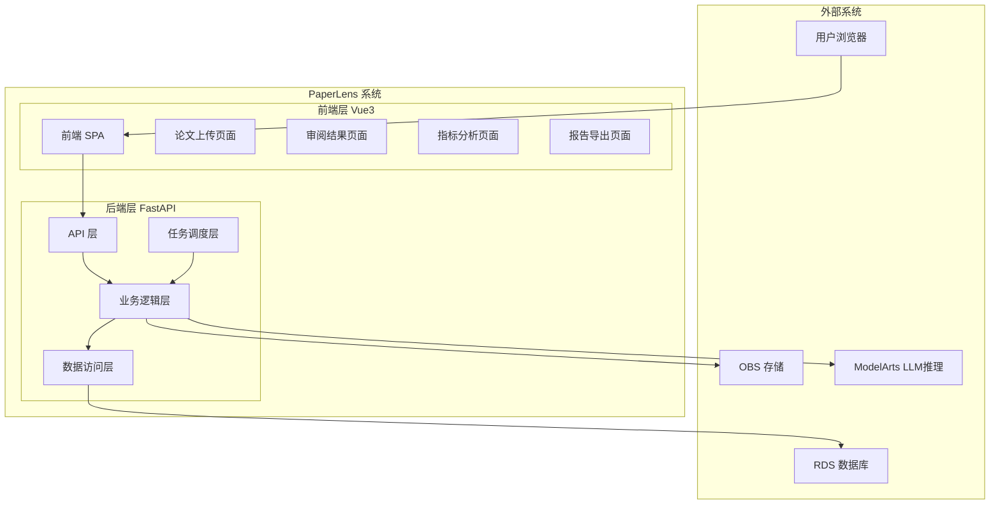
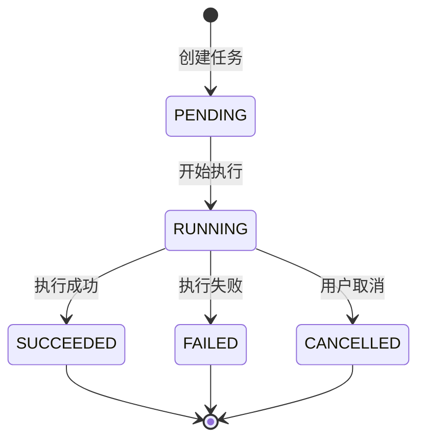
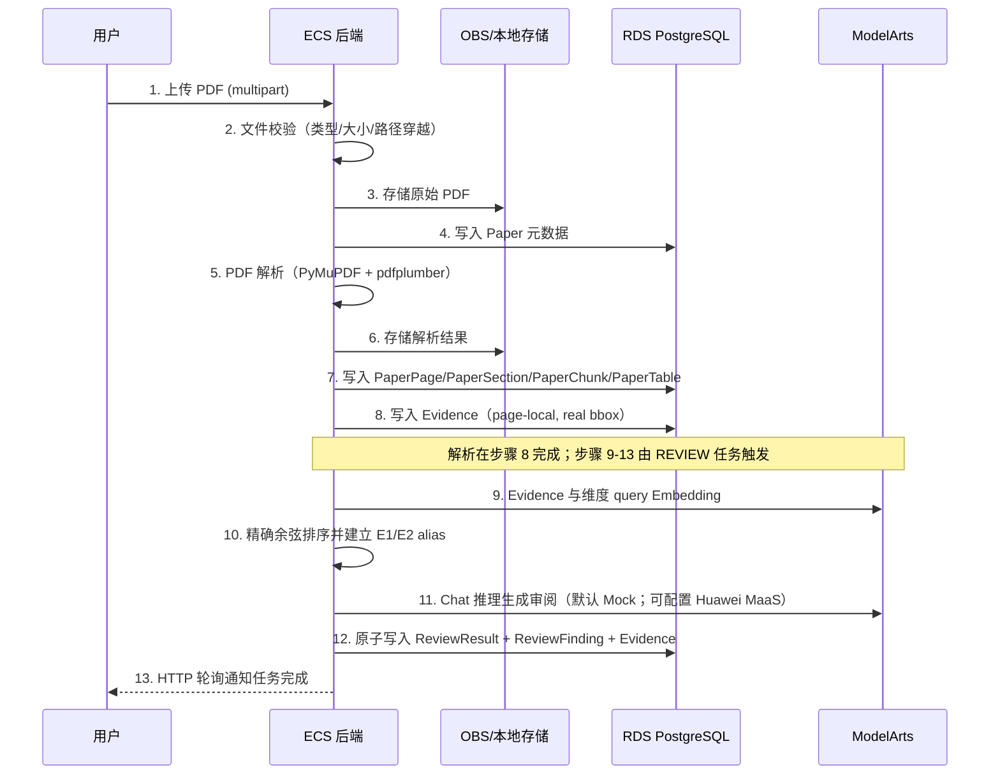
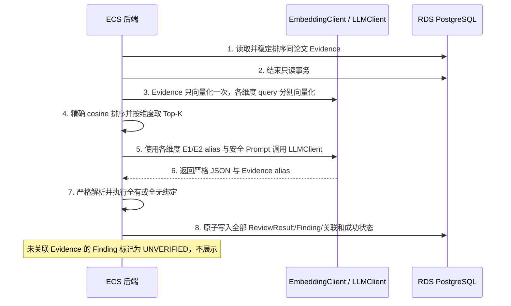
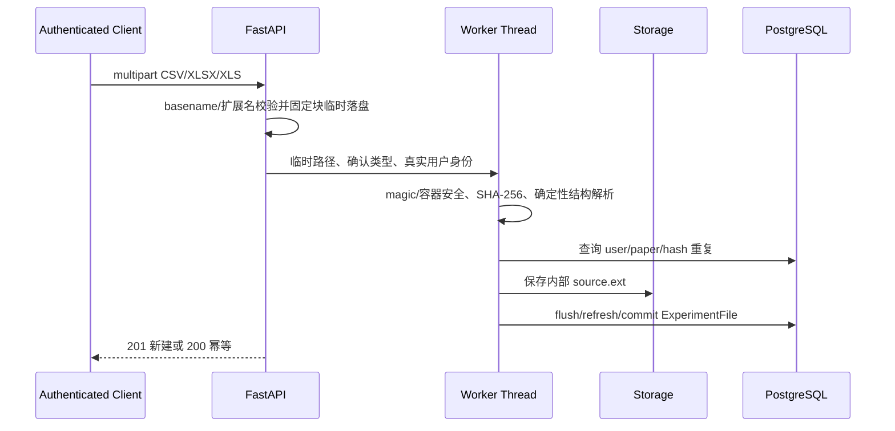

# 架构设计文档

## 文档信息

- **项目名称**: PaperLens
- **文档版本**: v1.0
- **创建日期**: 2026-07-13
- **最后更新**: 2026-07-13

## 1. 架构概览

### 1.1 系统架构图



### 1.2 技术栈

| 层次 | 技术选型 | 版本 | 说明 |
|------|----------|------|------|
| 前端框架 | Vue3 + TypeScript | 3.x | 组合式 API + `<script setup>` |
| UI组件库 | Element Plus | - | PC 端组件库（📋 PLANNED，尚未引入） |
| 状态管理 | Pinia | 3.x | Vue3 官方推荐状态管理 |
| HTTP客户端 | Axios | - | API 请求封装 |
| 后端框架 | FastAPI | 0.100+ | 异步 Python Web 框架 |
| ORM | SQLAlchemy | 2.x | 声明式 ORM + Alembic 迁移 |
| 数据库 | PostgreSQL | 15+ | RDS 云数据库 / 本地 Docker |
| 文件存储 | LocalStorage / OBS | - | 本地 `./data/uploads/`，云端华为云 OBS |
| Web服务器 | Uvicorn | - | ASGI 服务器 |
| 容器化 | Docker Compose | - | PostgreSQL + backend + frontend |

**可选组件(按需引入)**：
- 华为云 MaaS Embedding: P3.2 适配器已实现，按配置启用；默认 MockEmbeddingClient 不访问网络
- FAISS/pgvector: 持久化向量索引与大规模检索，后续阶段评估
- Celery + Redis: 生产级任务队列，替代 FastAPI BackgroundTasks
- 华为云 MaaS 标准 API V2: HuaweiMaaSLLMClient 已在 P3.3 实现，按配置启用

## 2. 架构决策记录(ADR)

### ADR-001: 选择 FAISS 而非独立向量数据库

**状态**：规划决策；P3.2 尚未落地持久化索引

**背景**：
- MVP 阶段数据量可控（单篇论文约数百 chunk）
- 需要为文本块建立向量索引以支持 Evidence 检索
- Milvus / OpenSearch 等独立向量数据库引入额外基础设施依赖

**决策**：
使用 FAISS 作为向量索引方案，索引可序列化到 OBS 持久化。

**理由**：
1. MVP 阶段数据量小，FAISS 足够满足性能需求
2. 避免引入额外基础设施依赖（Milvus 需独立部署）
3. FAISS 索引可序列化到 OBS 持久化，部署简单
4. 后续可迁移至 Milvus / OpenSearch 向量检索

**后果**：
- 正面：部署简单，无额外依赖，MVP 快速交付
- 负面：FAISS 不支持分布式，大规模场景需迁移

### ADR-002: 使用 FastAPI BackgroundTasks 而非 Celery

**状态**：已接受（仅 MVP 阶段）

**背景**：
- PDF 解析、审阅生成等任务为异步长时间运行
- Celery + Redis 方案成熟但引入额外依赖
- MVP 阶段并发量低，BackgroundTasks 足够

**决策**：
MVP 阶段使用 FastAPI BackgroundTasks，后续版本迁移至 Celery + Redis。

**理由**：
1. MVP 阶段并发量低，BackgroundTasks 满足需求
2. 避免引入 Redis 和 Celery 的运维成本
3. 保持项目简洁，快速迭代

**后果**：
- 正面：零额外依赖，开发速度快
- 负面：非生产级方案，不支持任务重试、分布式调度

### ADR-003: Evidence 页内定位（page-local）而非跨页 span

**状态**：已接受

**背景**：
- 审阅结论需绑定原文 Evidence，前端需高亮定位
- 跨页 span 实现复杂度高（需处理分页断句、bbox 跨页）
- PyMuPDF block 提供页内真实 bbox 坐标

**决策**：
Evidence 采用 page-local 定位，基于 PyMuPDF block 提取，使用真实 bbox 坐标，不涉及跨页 span。

**理由**：
1. PyMuPDF block 天然为页内单位，bbox 坐标准确
2. 前端基于 `normalized_text_content` 字符区间高亮，实现简单
3. 跨页 span 场景极少，ROI 低

**后果**：
- 正面：实现简单，定位准确
- 负面：极少数跨页 Evidence 需拆分为多条

## 3. 系统分层设计

### 3.1 前端分层

```
frontend/
├── src/
│   ├── api/              # API 请求封装
│   ├── components/       # 通用组件
│   ├── views/            # 页面视图
│   │   ├── HomeView      # 首页
│   │   ├── UploadView    # 论文上传
│   │   ├── ReviewResultView # 审阅结果
│   │   ├── MetricAnalysisView # 指标分析（P4.2 已实现）
│   │   └── ReportExportView # P6.2 三格式报告导出
│   ├── stores/           # Pinia 状态管理
│   ├── router/           # 路由配置
│   └── utils/            # 工具函数
```

前端职责：
- 文件上传（multipart 流式上传，最大 50MB）
- 展示论文解析结果与 Evidence 定位（基于 `normalized_text_content` 字符区间高亮）
- 展示审阅结果、任务进度、Finding 筛选与 Evidence 深链；P4.2 已实现指标任务交互、表格、筛选分页和来源追溯
- 配置 Markdown/PDF/DOCX 报告、分页查看历史、轮询状态并安全下载（P6.2 已实现）
- 后端不可用时显示明确错误

### 3.2 后端分层

```
backend/
├── app/
│   ├── api/              # REST API 路由
│   ├── core/             # 配置、安全、依赖注入
│   ├── models/           # SQLAlchemy ORM 模型
│   ├── schemas/          # Pydantic 请求/响应模型
│   ├── services/         # 业务逻辑
│   │   ├── pdf_parser    # PDF 解析服务
│   │   ├── chunker       # 文本分块服务
│   │   ├── embedder      # 向量化服务
│   │   ├── retriever     # 证据检索服务
│   │   ├── reviewer      # 审阅生成服务
│   │   ├── metric_extractor  # 指标提取服务
│   │   ├── experiment_analyzer  # 实验数据分析服务
│   │   └── exporter      # 报告导出服务
│   ├── tasks/            # 后台任务定义
│   └── utils/            # 工具函数
```

### 3.3 职责划分

| 层次 | 职责 | 示例 |
|------|------|------|
| API层 | 处理HTTP请求/响应、参数验证、UUID 路径参数校验 | 路由定义、请求解析、422 返回 |
| Service层 | 业务逻辑处理、事务管理、SAVEPOINT 降级 | PDF 解析流程、Evidence 提取 |
| Model层 | 数据模型定义、ORM映射、CheckConstraint | 17 张 ORM 应用表 |
| Schema层 | 数据验证、序列化 | Pydantic 请求/响应模型 |

## 4. 核心模块设计

### 4.1 后台任务处理模块



**核心功能**：
- 文件校验（类型检查、大小限制、路径穿越检测）
- PDF 解析与结构化（文本、页面、章节、表格）
- 文本分块与 page-local Evidence 提取（已实现）
- 任务内 Evidence 即时 Embedding 与按维度精确余弦 Top-K（P3.2 已实现）；FAISS/pgvector 持久化索引仍为规划
- 可替换 LLM 结构化审阅后端闭环（P3.1 Mock、P3.3 Huawei MaaS 已实现）；指标、实验分析和三格式报告导出均已实现

**任务类型**：
- REVIEW：审阅生成
- METRIC_EXTRACTION：指标提取
- EXPERIMENT_ANALYSIS：实验数据分析

### 4.2 LLM 调用抽象模块

LLM 必须通过统一 `LLMClient` 接口调用：

```python
class LLMClient(ABC):
    @abstractmethod
    def chat(self, messages: list[dict], **kwargs) -> dict: ...

class MockLLMClient(LLMClient):
    """默认实现，返回固定结构化响应，无需云端密钥即可演示"""

class HuaweiMaaSLLMClient(LLMClient):
    """华为云 MaaS 标准 API V2 非流式推理适配器"""
```

当前支持 `PAPERLENS_LLM_BACKEND=mock|huawei_maas`，默认 Mock 离线运行；启用 Huawei MaaS 时必须通过环境安全注入 API Key。

### 4.3 存储抽象模块

```python
class StorageBackend(ABC):
    @abstractmethod
    async def save(self, key: str, data: bytes) -> str: ...
    @abstractmethod
    async def delete(self, key: str) -> None: ...

class LocalStorage(StorageBackend):
    """当前实现，本地文件系统 ./data/uploads/"""

class OBSStorage(StorageBackend):
    """后续版本，华为云 OBS"""
```

通过环境变量 `PAPERLENS_ENV=local|cloud` 切换。

## 5. 数据流设计

### 5.1 论文上传与解析流程



### 5.2 审阅生成流程（P3.3 当前）



Embedding 和 LLM 外部调用期间不持有 SQLAlchemy 事务；任一外部调用或响应校验失败时，任务安全进入 FAILED 且不留下部分结果。HuaweiMaaSLLMClient 保持统一接口和 Mock 默认实现，不改变审阅业务层或 API 契约。

## 6. 性能优化策略

### 5.3 P5.1 实验文件同步预检流程



CPU 和同步 I/O 在线程池内执行。临时文件在请求 finally 中删除；存储或数据库失败会 rollback 并补偿未归属对象。解析器不访问数据库、存储、LLM、Embedding 或网络。

### 6.1 数据库优化

- **索引设计**：为常用查询字段建立索引（user_id、file_hash、status、paper_id + page_number 联合唯一索引等）
- **查询优化**：避免 N+1 查询，使用 JOIN 和预加载
- **分页查询**：论文列表使用 `?page=1&page_size=20` 分页
- **连接池**：SQLAlchemy 连接池管理数据库连接

### 6.2 缓存策略

- **当前检索**：任务内即时向量化，不持久化、不跨任务缓存
- **向量索引缓存（规划）**：若后续引入 FAISS，再设计加载与失效策略
- **论文解析结果缓存**：已解析论文的章节/页面数据按需加载
- **缓存失效**：论文删除时清理关联缓存
- **缓存预热**：暂不实现，MVP 阶段数据量可控

### 6.3 前端优化

- **路由懒加载**：按需加载页面组件
- **请求去重**：使用 request id 防止陈旧响应覆盖（已实现）
- **轮询优化**：任务进行中 HTTP 轮询，完成后停止（已实现）
- **Evidence 高亮**：基于 `normalized_text_content` 字符区间高亮，无需 PDF.js bbox 覆盖层

## 7. 安全设计

### 7.1 文件安全

- 文件类型校验（仅接受包含可提取文本的 PDF）
- 文件大小限制（PDF 最大 50MB，CSV/Excel 最大 20MB）
- 路径穿越防护
- 文件名安全处理
- P5.1 实验文件固定块实际字节限制、CSV 确定性解码、XLSX ZIP bomb/路径/active content 防护、XLS OLE magic

### 7.2 数据安全

- 用户数据隔离（不同用户的论文和审阅结果严格隔离）
- PDF SHA-256 去重/复用逻辑仍规划；P5.1 实验文件已按 user/paper/SHA-256 幂等
- HTTPS 传输加密（云端部署）
- SQL 注入防护（ORM 参数化查询）

### 7.3 认证安全

- Bearer JWT access + 数据库 AuthSession 双重鉴权（✅ P3.5 CURRENT）
- Token 过期机制（📋 PLANNED）
- refresh/reset 使用不透明随机 token，服务端仅存 SHA-256 摘要
- 华为云 IAM 仅管理云资源身份，不代替 PaperLens 产品账号

### 7.4 错误信息安全

- `_safe_error_message()` 安全错误映射，不泄露内部异常信息
- 统一错误响应格式（含 `details` 字段）

## 8. 可扩展性设计

### 8.1 水平扩展

- 无状态设计，支持多实例部署
- 后续版本使用 Redis 共享会话
- 数据库读写分离（未来）

### 8.2 功能扩展

- LLM 可替换：统一 `LLMClient` 接口，`MockLLMClient` / `MaaSLLMClient` 切换
- 存储可替换：统一 `StorageBackend` 接口，`LocalStorage` / `OBSStorage` 切换
- Embedding 可替换：统一 `EmbeddingClient`，默认 Mock，可配置华为云 MaaS 适配器
- 持久化索引可迁移（规划）：FAISS/pgvector → Milvus / OpenSearch

### 8.3 数据扩展

- JSONB 字段存储扩展属性（structured_data、columns_info、summary_stats 等）
- 环境变量配置切换（`PAPERLENS_ENV=local|cloud`）

## 9. 监控与运维

### 9.1 监控指标

- 系统指标：CPU、内存、磁盘、网络
- 应用指标：请求量、响应时间、错误率
- 业务指标：论文上传数、解析成功率、任务完成率

### 9.2 日志管理

- 应用日志：请求日志、错误日志
- 业务日志：PDF 解析日志、任务执行日志
- 本地开发：控制台输出
- 云端部署：华为云 LTS 日志服务

### 9.3 告警策略

- 系统异常告警
- 任务失败率告警
- 存储空间告警
- 安全告警

### 9.4 本地开发与云端部署差异

| 维度 | 本地开发 | 云端部署 |
|------|---------|---------|
| 文件存储 | 本地文件系统 `./data/uploads/` | 华为云 OBS |
| 数据库 | 本地 PostgreSQL（Docker Compose） | 华为云 RDS PostgreSQL |
| Evidence 检索 | MockEmbeddingClient + 任务内精确余弦 Top-K | 华为云 MaaS Embedding 可配置；持久化索引仍为规划 |
| LLM 推理 | 默认 MockLLMClient；可配置 HuaweiMaaSLLMClient | 华为云 MaaS 标准 API V2（需用户开通并配置） |
| PDF 解析 | 本地 PyMuPDF / pdfplumber | 同左 |
| 任务队列 | FastAPI BackgroundTasks | Celery + Redis（后续版本） |
| 前端 | Vite dev server | Nginx 静态托管 |
| HTTPS | 无（HTTP localhost） | 华为云 ELB + SSL 证书 |
| 认证 | JWT access + HttpOnly refresh cookie；本地显式关闭 Secure | 同一产品认证；HTTPS 下 Secure cookie，secret 由部署平台注入 |
| 日志 | 控制台输出 | 云日志服务 LTS |

## 10. P4.1 指标提取数据流

`Bearer 会话 → 论文所有权/PARSED 校验 → 确定性候选预检 → 活动任务唯一性 → 来源快照 → 结束读事务 → 纯 Python 提取/去重 → 同论文来源复核 → MetricRecord + SUCCEEDED 原子提交`。

失败分支整批回滚并只保存安全错误；公开查询再次联查 task、paper、user 和来源归属。当前不经过 LLMClient、EmbeddingClient 或任何外部网络。

---

## P4.3 MaaS 运行配置链路

`本机 .env / 部署 Secret → Docker Compose 单项透传 → Pydantic SecretStr → LLMClient 工厂 → HuaweiMaaSLLMClient`。未配置时链路在 Compose 第一层保持 `mock`。`maas-config-check` 只构造并验证 client，不创建 HTTP 请求；`maas-smoke --confirm-billable` 最多请求 32 个 completion token，执行一次非流式 chat，并只输出固定摘要。

Compose 将自身以只读方式挂载到 backend，唯一用途是让 Docker 测试直接验证实际运行配置，不复制配置样本，也不包含展开后的 secret。

## 11. P5.2 实验统计数据流

`认证用户 → ExperimentFile/Paper 归属校验 → 5,000,000 数值单元格前置门 → EXPERIMENT_ANALYSIS 活动任务唯一约束 → 后台原子认领 → storage/hash/容器/完整 columns_info 复核 → 逐行规范值迭代 → Welford + 精确 median → ExperimentResult + SUCCEEDED 原子提交`。

统计链路不构造 LLM 或 Embedding client，不访问网络。FastAPI BackgroundTasks 仍是当前任务承载方式，进程重启恢复和持久化队列继续属于部署阶段，不伪报生产级可靠性。

## 12. P5.3a 指标交叉验证数据流

`认证用户 → ExperimentFile/Paper/User 归属 → ExperimentResult 行锁及 EXPERIMENT_ANALYSIS 图校验 → SUCCEEDED METRIC_EXTRACTION 任务校验 → MetricRecord 与来源归属复核 → 名称/口径确定性匹配 → 严格 Comparison Schema → metric_comparisons 原子提交`。

同源请求在锁内返回既有结果，异源请求不覆盖。flush/commit 失败回滚；提交结果未知时使用独立 Session 重查。该链路只读取结构化统计与指标字段，显式延迟加载 raw_text，并只投影来源 id/paper_id。

## 13. P5.3b 前端编排数据流

`受保护路由 → 并行加载 Paper/Task → 分页 ExperimentFile → 选择文件 → 并行加载可信详情/既有结果 → 可选创建统计任务并轮询 → 可选创建交叉验证`。

该阶段不新增后端服务、数据库表、迁移或外部网络依赖。Vue 组件使用页面代数、文件选择代数与明确的 paper/file/task 标识拒绝陈旧响应；上传 multipart boundary 交由浏览器生成。既有比较结果从 GET result 恢复并锁定来源，未知错误统一映射为公开文案。

## 14. P6.1 Markdown 导出数据流

`认证用户 → Paper 归属/PARSED 校验 → 完整来源图复核 → 只含 id 的 source_snapshot → 确定性 Markdown bytes/content_hash/source_hash → 来源感知唯一约束写入 PENDING → 后台条件 UPDATE 原子认领 GENERATING → 保存创建时 bytes → storage 回读 size/SHA-256 → READY + file_size 原子提交`。

生成链路不构造 LLM/Embedding client，不访问网络。FastAPI BackgroundTasks 承载后台任务，但不宣称具备进程重启恢复；该能力留 P8。相同来源/内容/选项返回幂等 200，不同来源可新建；存储或提交失败时回查 READY 归属，否则删除未归属对象并只保存固定安全错误。

## 15. P6.2 PDF/DOCX 导出数据流

`认证用户 → Paper 归属/PARSED 校验 → 完整来源图复核 → 只含 id 的 source_snapshot → 确定性 Markdown bytes → report_converter 转 PDF(reportlab) 或 DOCX(python-docx) → 确定性 bytes/content_hash/source_hash → 来源感知唯一约束写入 PENDING → 后台条件 UPDATE 原子认领 GENERATING → 保存创建时 bytes → storage 回读 size/SHA-256 → READY + file_size 原子提交`。

PDF 生成使用 reportlab，固定 creator/producer/creation/modification 信息和文档 id，不读取当前时钟；用 PyMuPDF 验证文本与页数；无 JavaScript/附件/表单/外部资源。DOCX 生成使用 python-docx，固定 core properties，清除易变 rsid/修订信息，按 entry 名排序、固定 ZIP timestamp/权限/压缩参数重新打包；无宏/OLE/外部 relationship。三种格式在相同 user/paper/language/include/source 下各自独立 ExportReport；同格式同源同 bytes 幂等 200，不同来源 201，FAILED 可重试。012 迁移调整 ck_export_p61_source 约束使 source_snapshot 非空的 MARKDOWN/PDF/DOCX 均合法。

## 16. P7.1 阅读学习架构（COMPLETED）

```text
PaperReadingView
  ├─ 既有 Paper / Section / Page / Evidence API
  └─ Learning Explanation API
       ├─ 所有权与 PARSED 校验
       ├─ 服务端解析 SECTION / PAGE / EVIDENCE 范围
       ├─ 确定性选择并别名化 Evidence
       ├─ LLMClient（Mock / Huawei MaaS）
       ├─ 严格 JSON 校验与 Evidence 绑定
       └─ LearningExplanation + Citation 原子持久化
```

P7.1 不复用 ReviewResult 表伪装学习结果，也不改变既有 AnalysisTask 契约。学习解释使用独立状态机和存储模型，避免“审稿评分”语义继续渗入阅读主线。论文标题、正文和 Evidence 都作为不可信数据放入明确边界；模型输出只有在 JSON 结构、长度、枚举和全部引用验证成功后才能持久化为 SUCCEEDED。

外部 LLM 调用期间不持有数据库事务。创建阶段只保存服务端确认的 scope 和请求摘要；后台重新读取并复核 user/paper/scope/source hash，推理完成后在单一事务中写入答案、结构化学习要点、术语和有序 Citation。失败只保存固定公开错误，不保存原始响应或底层异常。

P7.1 只做单轮、固定模式的总结/解释/翻译；自由问题、多轮会话和检索式问答留 P7.2，个人笔记与知识卡留 P7.3。

### 16.4 实现验收

独立 learning router/schema/service 已接入现有 AuthContext 和 LLMClient。创建事务完成所有权、PARSED、scope、来源大小、Evidence 和 canonical hash 校验；后台原子认领后关闭事务再推理；持久化前重新读取完整来源图并一次性写结果与 Citation。3 条 API 和 PaperReadingView 已交付，P7.2/P7.3 未提前实现。

**文档版本**：v1.8
**创建日期**：2026-07-13
**最后更新**：2026-07-15

## 17. P7.2 论文内问答架构

新增独立 `qa` router/schema/service/retriever，不复用 ReviewResult，也不把问答逻辑塞入 learning service。同步创建事务完成 owner、PARSED、Evidence、幂等和活动轮次检查；后台条件更新认领 RUNNING 后关闭事务，再批量生成 query + Evidence 向量并确定性排序。上下文哈希覆盖 conversation/paper/turn sequence、语言、问题哈希、历史问答哈希以及候选 Evidence 文本哈希。

LLM 使用 `operation=paper_qa`、language 和 evidence_aliases，只接受严格单 JSON。成功事务锁定 Turn，重新加载完整所有权图、预算后的历史和全部候选 Evidence，复算 context_hash 后一次写入 answer、grounded、Citation、SUCCEEDED 和 conversation.updated_at。失败补偿清除 context_hash，只保留固定公开错误。前端复用 PaperReadingView，通过独立 paper/conversation/turn/poll 代数隔离分页、轮询和路由竞态。

## 18. P7.3 个人学习沉淀架构

新增 5 个独立 service 和 2 个 API router，不引入新的外部依赖：

```text
library_service          → 论文库条目 CRUD、LEFT JOIN 列表
highlight_service        → 高亮 CRUD、服务端 quoted_text 派生、source_hash 防篡
bookmark_service         → 书签 CRUD、重复页码唯一约束
note_service             → 笔记 CRUD、anchor_type 互斥校验、引用 409
card_service             → 知识卡 CRUD、source 互斥校验、mastery/archive

api/library.py           → /api/v1/library/papers, /papers/{id}/library-entry, /papers/{id}/reading-progress
api/personal_learning.py → highlights, bookmarks, notes, knowledge-cards 全部 CRUD
```

所有服务均为确定性 Python 代码，不构造 LLMClient 或 EmbeddingClient，不访问网络。高亮创建时服务端从 `paper_pages.normalized_text_content` 和客户端提交的 `char_start/char_end` 派生 `quoted_text`，并计算 `source_hash` 做完整性校验。删除高亮前检查笔记和知识卡引用，存在引用时返回 409 而非级联删除。

前端 PaperListView 升级为论文库视图，通过 LEFT JOIN 一次性获取论文元数据与可选的库条目信息。PaperReadingView 新增"学习记录"标签页，包含高亮/书签/笔记/知识卡四个子标签。阅读进度通过串行 PATCH 调用更新，前端保证同一论文同一时刻最多一个在途进度请求。

## 19. P8.1 完整管理员系统与不可变审计架构

新增 3 个模块，不引入新的外部依赖：

```text
admin_service            → 管理员业务逻辑：仪表盘聚合、用户查询/变更、跨用户只读治理、并发管理员保护
admin_router             → /api/v1/admin/ 下 8 个 API 端点
cli/admin_bootstrap.py   → python -m paperlens.cli admin-bootstrap
```

新增 ORM 模型 `AdminAuditLog`（append-only 审计日志），017 Alembic 迁移创建 `admin_audit_logs` 表及 PostgreSQL trigger 拒绝 UPDATE/DELETE。管理员授权复用现有 `require_admin` 依赖，不引入新的中间件或角色模型。跨用户只读查询使用 SQLAlchemy `load_only` 列投影，只返回管理员可见字段，不使用 deferred columns。

## 20. P8.2 全链路恢复与一致性架构

新增 RecoveryService 作为服务层组件，在 FastAPI lifespan startup 事件中执行陈旧状态检测与恢复。核心机制：

- **RecoveryService**：按 Paper → AnalysisTask → LearningExplanation → PaperQATurn → ExportReport 固定顺序，以 created_at/id 和有限批次扫描陈旧状态。
- **PostgreSQL advisory lock**：扫描事务使用 `pg_try_advisory_xact_lock`；锁繁忙时当前实例立即跳过，不阻塞应用启动。事务提交即释放，外部处理不持锁、不持数据库事务。
- **恢复策略**：指标、实验分析、学习解释和问答复用现有原子 claim 后异步重放；审阅、论文解析和导出在现有模型缺少完整重放输入或执行代次时安全 FAILED，避免猜参数、重复写入或覆盖迟到成功。
- **FastAPI lifespan 集成**：startup 执行一次有限扫描，提交后才启动少量 daemon worker，不新增永久恢复循环。
- **共享 usePolling composable**：论文解析、审阅、指标、实验、导出、学习解释和问答实际复用统一 3 秒轮询工具；单一在途、generation 隔离、卸载清理和 401 redirect 由同一实现负责。
- **最小契约扩展**：TaskDetail 增加可空 `experiment_file_id`，用于刷新后恢复实验文件上下文；路由数量保持不变。

P8.2 状态：已完成并经码道独立收口；恢复扫描事务边界、安全重放范围和七类轮询复用均已按实现校准。

## 21. P8.3 性能、可靠性、限流与可观测性收口架构

不新增数据库表、字段、索引或 Alembic 迁移。新增 4 个后端模块，不引入新的外部依赖：

```text
core/request_tracing.py      → 请求追踪中间件：X-Request-ID 生成/复用、contextvars 传播、结构化请求日志
core/rate_limiter.py         → 固定窗口限流器：classify_scope、resolve_client_ip、parse_trusted_cidrs
core/rate_limit_middleware.py → 限流中间件：429 JSON envelope + Retry-After + X-Request-ID
api/health.py (扩展)         → 新增 /health/live（存活）和 /health/ready（就绪 + SELECT 1）
```

核心机制：

- **请求追踪**：入站 X-Request-ID 仅严格 UUID4 时复用，否则生成新 UUID4；所有响应返回 X-Request-ID；request_id_ctx contextvars 贯穿请求生命周期。
- **应用内限流**：单进程固定窗口，按 scope 分组（exempt/auth/upload/read/write）；/api/v1/health* 完全豁免；超限返回 429 JSON（code=RATE_LIMITED、固定中文安全 message、details=null）+ 整数 Retry-After + X-Request-ID。
- **可信代理**：默认可信代理列表为空（直接 TCP peer）；仅 `PAPERLENS_TRUSTED_PROXY_CIDRS` 显式配置且直接 peer 可信时，才从右向左剥离可信代理并取得第一个非可信来源地址。
- **结构化日志**：只记录 request_id/method/route_template/status/duration_ms/rate_scope；禁止记录 query string、请求/响应 body、Authorization/cookie/header 全量、IP、email、论文内容、文件名/路径、hash、token、secret、DSN、SQL 参数或异常正文。
- **数据库连接池**：pool_pre_ping=True、pool_size=5、max_overflow=10、pool_timeout=10s、pool_recycle=1800s。
- **恢复派发并发**：ThreadPoolExecutor（默认 4 worker，范围 1～32）替代逐次 daemon Thread；executor 由 lifespan 创建并在 shutdown 关闭。
- **N+1 修复**：list_reviews 使用 selectinload 急加载 findings + evidences（3 查询替代 1+N+M）；list_qa_conversations 使用批量聚合查询替代逐会话查询。
- **查询收口**：list_tasks 返回最近 200 条；list_reviews 使用带 VERIFIED 条件的 selectinload；list_qa_conversations 使用两条批量查询。Evidence 列表不做固定截断，避免静默丢失论文证据。

P8.3 状态：已完成并经码道独立收口；定向 3 passed、查询回归 2 passed、隔离 HTTP 烟测通过。

## 22. P8.4 华为云部署、备份恢复与综合安全验收架构

不新增数据库表、字段、索引或 Alembic 迁移。核心变更：

```text
utils/storage.py (重写)     → OBSStorage 实现 + context-managed materialize + key 规范化 + 工厂单例/close
core/config.py (扩展)       → PAPERLENS_ENV + OBS 配置 + production model_validator + docs_enabled
main.py (扩展)              → lifespan 关闭 storage + 生产文档关闭
deploy/huawei/ (新增)       → docker-compose.prod.yml + nginx.prod.conf + Dockerfile.prod + backup-restore.md
```

核心机制：

- **OBSStorage**：使用 `esdk-obs-python` SDK，延迟导入（仅 storage_backend=obs 时初始化）；ECS Agency 优先，ENV fallback；私有对象 + SSE-OBS/SSE-KMS；严格 key 规范化（拒绝空/绝对路径/反斜杠/..段/控制字符/超长）。
- **Context-managed materialize**：新增 `materialize(storage_key)` 上下文管理器；LocalStorage 直接 yield 已校验路径；OBSStorage 下载到唯一临时文件，finally 中关闭并删除；所有生产调用者（exports、experiment_analysis、export_service）已迁移。
- **生产配置校验**：PAPERLENS_ENV=production 时拒绝 debug/local storage/HTTP OBS/占位 JWT/非 Secure cookie/缺失 OBS 必需配置/KMS 无 key id；docs_enabled 属性控制 OpenAPI 文档关闭。
- **Secret 注入**：entrypoint.prod.sh 读取 `*_FILE` 环境变量指向的文件内容，不 set -x 或打印；Compose secrets 从宿主机受限文件注入。
- **生产 Docker**：非 root 用户、read-only filesystem、tmpfs /tmp、no-new-privileges、cap_drop ALL、资源限制、healthcheck、独立 migrate 服务。
- **生产 Nginx**：不盲目信任 X-Forwarded-For/X-Real-IP；安全响应头（CSP/X-Frame-Options/X-Content-Type-Options/Referrer-Policy）；禁止目录浏览。
- **备份恢复**：RDS 自动备份 + PITR + 发布前手工备份 + 恢复到新实例并只读核对；OBS 版本控制 + SSE + 生命周期；回滚以镜像版本为主。

P8.4 初版状态：代码、部署资产和文档实现完毕；随后已按 22.1 完成独立集中验收与直接收口，真实华为云发布仍由用户执行。

### 22.1 P8.4 收口校准

OBS ECS Agency 使用 SDK 的 `security_provider_policy="ECS"`，上传使用私有 `PutObjectHeader` 与 SSE header，save/get/delete 均检查 2xx。超时统一为 `PAPERLENS_OBS_TIMEOUT_SECONDS`，TLS 默认使用系统 CA，可显式指定 CA bundle。

生产链路最终为 `ELB/WAF -> ECS 私网 8080 -> 非 root Nginx -> Compose 私网 backend:8000 -> RDS/OBS/MaaS`。migrate 与 backend 使用同一生产镜像和 Secret 入口；RDS DSN 与 CA 均以 Secret 文件注入。前后端生产镜像已在只读根文件系统和最小能力下启动验收，P8.4 状态更新为已完成并经码道独立收口。

## 23. 论文学习报告导出架构调整

`export_service` 在创建任务时一次性读取论文元数据、成功的学习解释、本用户高亮与笔记，并按需读取成功审阅、指标和实验分析。所有来源先完成所有权与关联完整性校验，再生成 source snapshot、Markdown bytes 和内容哈希；PDF/DOCX 仅转换该 Markdown，不在后台重新查询来源。审阅来源允许为空，因此导出链路只依赖论文状态为 `PARSED`。

前端 `ReportExportView` 将核心学习内容和扩展分析分区呈现。核心内容固定加入；审阅结果有则自动加入；指标与实验分析保持显式开关。导出任务状态机、历史分页、幂等创建和下载完整性校验保持不变。

## 24. 学习解释退出交互影响

本次仅调整 `PaperReadingView` 组件内部状态：复用 `clearAssistant` 取消活动解释和轮询，再定位解释历史区域；不触发 Vue Router、后端 API、数据库或跨页面状态变更。

## 25. 轻量单机部署补充

为小规模实习项目增加独立的 ECS 单机部署档案，不替换第 22 节的正式华为云生产架构。公网流量仅进入前端 Nginx 的 80 端口，Nginx 通过 Docker 私有网络访问 FastAPI，FastAPI 通过同一私有网络访问 PostgreSQL；后端 8000 与数据库 5432 均不映射到主机。

单机档案使用本地 Docker 卷保存 PostgreSQL 数据和论文文件，继续调用华为云 ModelArts MaaS，暂用 mock embedding。ECS 采用 4 GiB 内存加 2 GiB Swap，容器设置资源上限；当前直接使用 HTTP，因此关闭 Secure Cookie 并由 Nginx 传递真实协议。该档案仅用于低成本演示，不具备 RDS、OBS、ELB、HTTPS 和多实例高可用能力。
