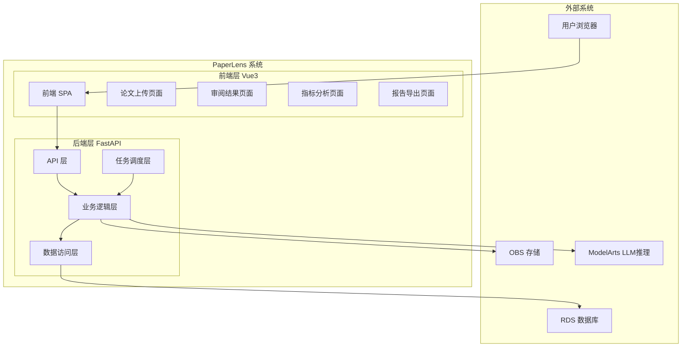
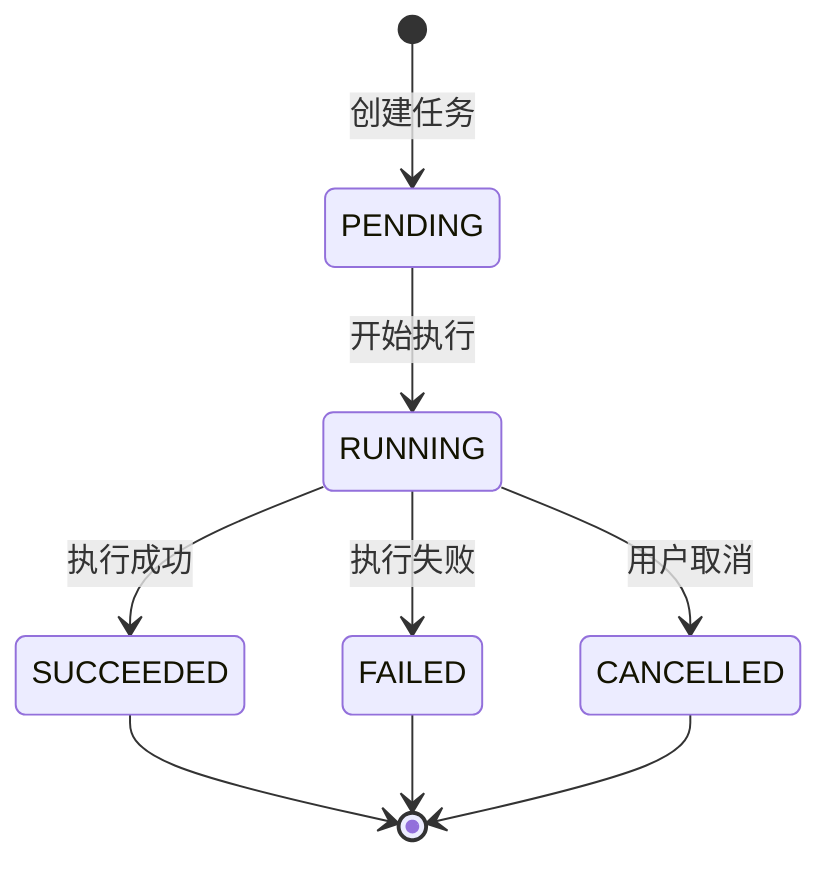
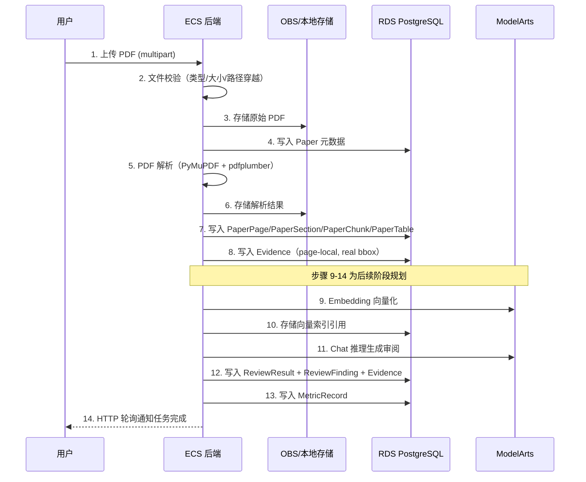
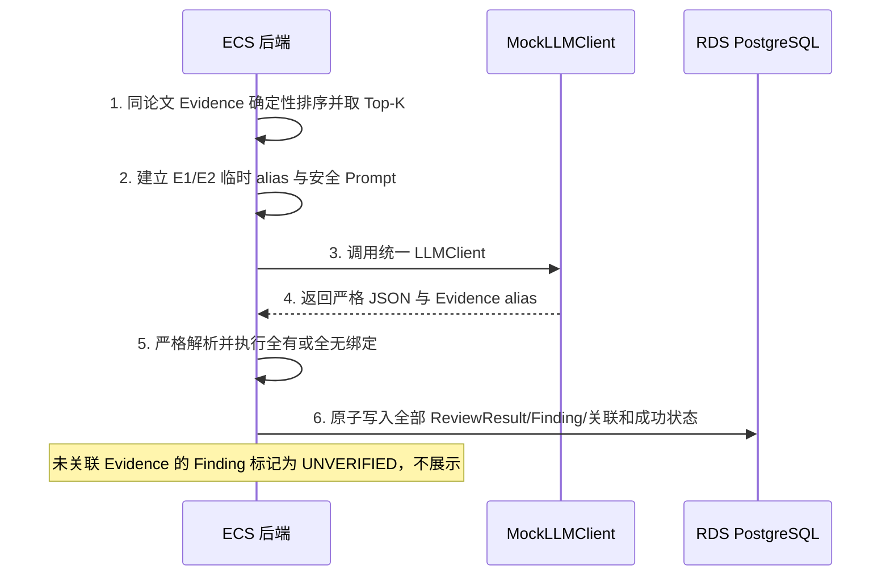

# 架构设计文档

## 文档信息

- **项目名称**: PaperLens
- **文档版本**: v1.0
- **创建日期**: 2026-07-13
- **最后更新**: 2026-07-13

## 1. 架构概览

### 1.1 系统架构图



### 1.2 技术栈

| 层次 | 技术选型 | 版本 | 说明 |
|------|----------|------|------|
| 前端框架 | Vue3 + TypeScript | 3.x | 组合式 API + `<script setup>` |
| UI组件库 | Element Plus | - | PC 端组件库（📋 PLANNED，尚未引入） |
| 状态管理 | Pinia | 3.x | Vue3 官方推荐状态管理 |
| HTTP客户端 | Axios | - | API 请求封装 |
| 后端框架 | FastAPI | 0.100+ | 异步 Python Web 框架 |
| ORM | SQLAlchemy | 2.x | 声明式 ORM + Alembic 迁移 |
| 数据库 | PostgreSQL | 15+ | RDS 云数据库 / 本地 Docker |
| 文件存储 | LocalStorage / OBS | - | 本地 `./data/uploads/`，云端华为云 OBS |
| Web服务器 | Uvicorn | - | ASGI 服务器 |
| 容器化 | Docker Compose | - | PostgreSQL + backend + frontend |

**可选组件(按需引入)**：
- FAISS: 向量索引，P3 阶段引入
- Celery + Redis: 生产级任务队列，替代 FastAPI BackgroundTasks
- 华为云 ModelArts: LLM 推理端点，P3 阶段引入

## 2. 架构决策记录(ADR)

### ADR-001: 选择 FAISS 而非独立向量数据库

**状态**：已接受

**背景**：
- MVP 阶段数据量可控（单篇论文约数百 chunk）
- 需要为文本块建立向量索引以支持 Evidence 检索
- Milvus / OpenSearch 等独立向量数据库引入额外基础设施依赖

**决策**：
使用 FAISS 作为向量索引方案，索引可序列化到 OBS 持久化。

**理由**：
1. MVP 阶段数据量小，FAISS 足够满足性能需求
2. 避免引入额外基础设施依赖（Milvus 需独立部署）
3. FAISS 索引可序列化到 OBS 持久化，部署简单
4. 后续可迁移至 Milvus / OpenSearch 向量检索

**后果**：
- 正面：部署简单，无额外依赖，MVP 快速交付
- 负面：FAISS 不支持分布式，大规模场景需迁移

### ADR-002: 使用 FastAPI BackgroundTasks 而非 Celery

**状态**：已接受（仅 MVP 阶段）

**背景**：
- PDF 解析、审阅生成等任务为异步长时间运行
- Celery + Redis 方案成熟但引入额外依赖
- MVP 阶段并发量低，BackgroundTasks 足够

**决策**：
MVP 阶段使用 FastAPI BackgroundTasks，后续版本迁移至 Celery + Redis。

**理由**：
1. MVP 阶段并发量低，BackgroundTasks 满足需求
2. 避免引入 Redis 和 Celery 的运维成本
3. 保持项目简洁，快速迭代

**后果**：
- 正面：零额外依赖，开发速度快
- 负面：非生产级方案，不支持任务重试、分布式调度

### ADR-003: Evidence 页内定位（page-local）而非跨页 span

**状态**：已接受

**背景**：
- 审阅结论需绑定原文 Evidence，前端需高亮定位
- 跨页 span 实现复杂度高（需处理分页断句、bbox 跨页）
- PyMuPDF block 提供页内真实 bbox 坐标

**决策**：
Evidence 采用 page-local 定位，基于 PyMuPDF block 提取，使用真实 bbox 坐标，不涉及跨页 span。

**理由**：
1. PyMuPDF block 天然为页内单位，bbox 坐标准确
2. 前端基于 `normalized_text_content` 字符区间高亮，实现简单
3. 跨页 span 场景极少，ROI 低

**后果**：
- 正面：实现简单，定位准确
- 负面：极少数跨页 Evidence 需拆分为多条

## 3. 系统分层设计

### 3.1 前端分层

```
frontend/
├── src/
│   ├── api/              # API 请求封装
│   ├── components/       # 通用组件
│   ├── views/            # 页面视图
│   │   ├── HomeView      # 首页
│   │   ├── UploadView    # 论文上传
│   │   ├── ReviewView    # 审阅结果
│   │   ├── MetricsView   # 指标分析
│   │   └── ExportView    # 报告导出
│   ├── stores/           # Pinia 状态管理
│   ├── router/           # 路由配置
│   └── utils/            # 工具函数
```

前端职责：
- 文件上传（multipart 流式上传，最大 50MB）
- 展示论文解析结果与 Evidence 定位（基于 `normalized_text_content` 字符区间高亮）
- 展示审阅结果、指标表格与统计口径标注（规划，尚未实现）
- 触发报告导出并下载（规划，尚未实现）
- 后端不可用时显示明确错误

### 3.2 后端分层

```
backend/
├── app/
│   ├── api/              # REST API 路由
│   ├── core/             # 配置、安全、依赖注入
│   ├── models/           # SQLAlchemy ORM 模型
│   ├── schemas/          # Pydantic 请求/响应模型
│   ├── services/         # 业务逻辑
│   │   ├── pdf_parser    # PDF 解析服务
│   │   ├── chunker       # 文本分块服务
│   │   ├── embedder      # 向量化服务
│   │   ├── retriever     # 证据检索服务
│   │   ├── reviewer      # 审阅生成服务
│   │   ├── metric_extractor  # 指标提取服务
│   │   ├── experiment_analyzer  # 实验数据分析服务
│   │   └── exporter      # 报告导出服务
│   ├── tasks/            # 后台任务定义
│   └── utils/            # 工具函数
```

### 3.3 职责划分

| 层次 | 职责 | 示例 |
|------|------|------|
| API层 | 处理HTTP请求/响应、参数验证、UUID 路径参数校验 | 路由定义、请求解析、422 返回 |
| Service层 | 业务逻辑处理、事务管理、SAVEPOINT 降级 | PDF 解析流程、Evidence 提取 |
| Model层 | 数据模型定义、ORM映射、CheckConstraint | 13 张业务表 + 1 张关联表 |
| Schema层 | 数据验证、序列化 | Pydantic 请求/响应模型 |

## 4. 核心模块设计

### 4.1 后台任务处理模块



**核心功能**：
- 文件校验（类型检查、大小限制、路径穿越检测）
- PDF 解析与结构化（文本、页面、章节、表格）
- 文本分块与 page-local Evidence 提取（已实现）
- 向量索引与语义检索（规划，尚未实现）
- MockLLM 结构化审阅后端闭环（P3.1 已实现）；真实 LLM、指标提取和报告导出仍为规划

**任务类型**：
- REVIEW：审阅生成
- METRIC_EXTRACTION：指标提取
- EXPERIMENT_ANALYSIS：实验数据分析

### 4.2 LLM 调用抽象模块

LLM 必须通过统一 `LLMClient` 接口调用：

```python
class LLMClient(ABC):
    @abstractmethod
    def chat(self, messages: list[dict], **kwargs) -> dict: ...

class MockLLMClient(LLMClient):
    """默认实现，返回固定结构化响应，无需云端密钥即可演示"""

class MaaSLLMClient(LLMClient):
    """华为云 MaaS / ModelArts 推理端点实现（后续版本）"""
```

当前仅支持 `PAPERLENS_LLM_BACKEND=mock`；P3.3 接入 MaaS 后再开放 `maas` 配置值。

### 4.3 存储抽象模块

```python
class StorageBackend(ABC):
    @abstractmethod
    async def save(self, key: str, data: bytes) -> str: ...
    @abstractmethod
    async def delete(self, key: str) -> None: ...

class LocalStorage(StorageBackend):
    """当前实现，本地文件系统 ./data/uploads/"""

class OBSStorage(StorageBackend):
    """后续版本，华为云 OBS"""
```

通过环境变量 `PAPERLENS_ENV=local|cloud` 切换。

## 5. 数据流设计

### 5.1 论文上传与解析流程



### 5.2 审阅生成流程（P3.1 当前）



P3.2 将把第 1 步替换为华为云优先的 Embedding/语义检索实现；P3.3 将把 MockLLMClient 替换为 HuaweiMaaSLLMClient，同时保留统一接口和本地回退。

## 6. 性能优化策略

### 6.1 数据库优化

- **索引设计**：为常用查询字段建立索引（user_id、file_hash、status、paper_id + page_number 联合唯一索引等）
- **查询优化**：避免 N+1 查询，使用 JOIN 和预加载
- **分页查询**：论文列表使用 `?page=1&page_size=20` 分页
- **连接池**：SQLAlchemy 连接池管理数据库连接

### 6.2 缓存策略

- **向量索引缓存**：FAISS 索引加载后缓存在内存，避免重复反序列化
- **论文解析结果缓存**：已解析论文的章节/页面数据按需加载
- **缓存失效**：论文删除时清理关联缓存
- **缓存预热**：暂不实现，MVP 阶段数据量可控

### 6.3 前端优化

- **路由懒加载**：按需加载页面组件
- **请求去重**：使用 request id 防止陈旧响应覆盖（已实现）
- **轮询优化**：任务进行中 HTTP 轮询，完成后停止（已实现）
- **Evidence 高亮**：基于 `normalized_text_content` 字符区间高亮，无需 PDF.js bbox 覆盖层

## 7. 安全设计

### 7.1 文件安全

- 文件类型校验（仅接受包含可提取文本的 PDF）
- 文件大小限制（PDF 最大 50MB，CSV/Excel 最大 20MB）
- 路径穿越防护
- 文件名安全处理

### 7.2 数据安全

- 用户数据隔离（不同用户的论文和审阅结果严格隔离）
- SHA-256 文件哈希计算与存储（去重/复用逻辑 📋 PLANNED）
- HTTPS 传输加密（云端部署）
- SQL 注入防护（ORM 参数化查询）

### 7.3 认证安全

- Bearer Token（JWT）认证（📋 PLANNED: 当前 `_get_user_id()` 返回 `settings.demo_user_id`，无实际鉴权）
- Token 过期机制（📋 PLANNED）
- 无认证场景（MVP 阶段使用简单 Token）
- 后续版本集成 IAM / JWT

### 7.4 错误信息安全

- `_safe_error_message()` 安全错误映射，不泄露内部异常信息
- 统一错误响应格式（含 `details` 字段）

## 8. 可扩展性设计

### 8.1 水平扩展

- 无状态设计，支持多实例部署
- 后续版本使用 Redis 共享会话
- 数据库读写分离（未来）

### 8.2 功能扩展

- LLM 可替换：统一 `LLMClient` 接口，`MockLLMClient` / `MaaSLLMClient` 切换
- 存储可替换：统一 `StorageBackend` 接口，`LocalStorage` / `OBSStorage` 切换
- 向量索引可迁移：FAISS → Milvus / OpenSearch

### 8.3 数据扩展

- JSONB 字段存储扩展属性（structured_data、columns_info、summary_stats 等）
- 环境变量配置切换（`PAPERLENS_ENV=local|cloud`）

## 9. 监控与运维

### 9.1 监控指标

- 系统指标：CPU、内存、磁盘、网络
- 应用指标：请求量、响应时间、错误率
- 业务指标：论文上传数、解析成功率、任务完成率

### 9.2 日志管理

- 应用日志：请求日志、错误日志
- 业务日志：PDF 解析日志、任务执行日志
- 本地开发：控制台输出
- 云端部署：华为云 LTS 日志服务

### 9.3 告警策略

- 系统异常告警
- 任务失败率告警
- 存储空间告警
- 安全告警

### 9.4 本地开发与云端部署差异

| 维度 | 本地开发 | 云端部署 |
|------|---------|---------|
| 文件存储 | 本地文件系统 `./data/uploads/` | 华为云 OBS |
| 数据库 | 本地 PostgreSQL（Docker Compose） | 华为云 RDS PostgreSQL |
| 向量存储 | FAISS（规划） | FAISS 索引（ECS 本地）+ OBS 备份 |
| LLM 推理 | MockLLMClient | 华为云 ModelArts 推理端点 |
| PDF 解析 | 本地 PyMuPDF / pdfplumber | 同左 |
| 任务队列 | FastAPI BackgroundTasks | Celery + Redis（后续版本） |
| 前端 | Vite dev server | Nginx 静态托管 |
| HTTPS | 无（HTTP localhost） | 华为云 ELB + SSL 证书 |
| 认证 | 无 / 简单 Token | IAM 集成 / JWT |
| 日志 | 控制台输出 | 云日志服务 LTS |

---

**文档版本**：v1.0
**创建日期**：2026-07-13
**最后更新**：2026-07-13
