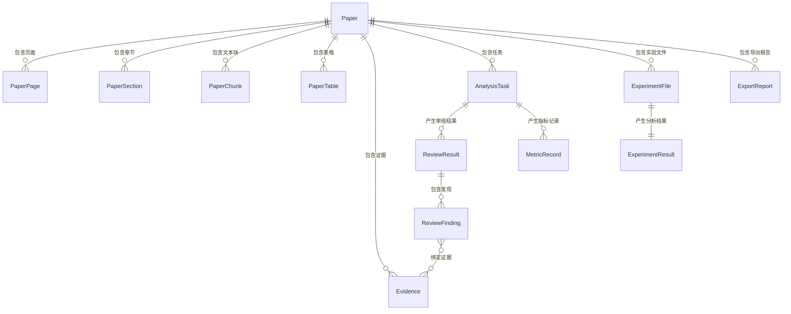

# 数据模型设计

## 文档信息

- **项目名称**: PaperLens
- **文档版本**: v1.1
- **创建日期**: 2026-07-13
- **最后更新**: 2026-07-13

## 1. 概念模型(ER图)



## 2. 逻辑模型

### 2.1 论文核心模型

#### Paper (论文主表) ✅ 已实现

| 字段名 | 数据类型 | 约束 | 说明 |
|--------|----------|------|------|
| id | UUID | PK | 主键 |
| title | VARCHAR(500) | NOT NULL | 论文标题（从 PDF 提取或用户填写） |
| filename | VARCHAR(255) | NOT NULL | 原始文件名 |
| storage_key | VARCHAR(1024) | NOT NULL | 存储路径，格式：papers/{paper_uuid}/source.pdf |
| file_size | BIGINT | NOT NULL | 文件大小（字节） |
| file_hash | VARCHAR(64) | NOT NULL | SHA-256 文件哈希（去重/复用逻辑 📋 PLANNED） |
| page_count | INTEGER | | 页数 |
| status | VARCHAR(20) | NOT NULL | UPLOADING / PROCESSING / PARSED / FAILED |
| error_message | TEXT | | 解析失败时的错误信息 |
| user_id | VARCHAR(128) | NOT NULL | 所属用户 |
| created_at | TIMESTAMP | NOT NULL | 创建时间 |
| updated_at | TIMESTAMP | NOT NULL | 更新时间 |

**状态枚举**：
- `UPLOADING`: 上传中
- `PROCESSING`: 解析处理中
- `PARSED`: 解析完成
- `FAILED`: 解析失败

#### PaperPage (论文页面表) ✅ 已实现

| 字段名 | 数据类型 | 约束 | 说明 |
|--------|----------|------|------|
| id | UUID | PK | 主键 |
| paper_id | UUID | FK → Paper.id | 所属论文 |
| page_number | INTEGER | NOT NULL | 页码（从 1 开始） |
| text_content | TEXT | | 页面纯文本内容 |
| normalized_text_content | TEXT | | 页面归一化文本（空白字符合并） |
| width | FLOAT | | 页面宽度（pt） |
| height | FLOAT | | 页面高度（pt） |
| storage_key | VARCHAR(1024) | | 🔴 PLANNED：页面图片存储路径（预留，ORM 中未实现） |

#### PaperSection (论文章节表) ✅ 已实现

| 字段名 | 数据类型 | 约束 | 说明 |
|--------|----------|------|------|
| id | UUID | PK | 主键 |
| paper_id | UUID | FK → Paper.id | 所属论文 |
| section_type | VARCHAR(50) | NOT NULL | 章节类型 |
| title | VARCHAR(500) | | 章节标题 |
| level | INTEGER | NOT NULL DEFAULT 1 | 标题层级（1=一级标题） |
| sequence | INTEGER | NOT NULL | 排序序号 |
| start_page | INTEGER | | 起始页码 |
| end_page | INTEGER | | 结束页码 |
| text_content | TEXT | | 章节正文内容 |

**section_type 枚举**：
- `ABSTRACT`: 摘要
- `INTRODUCTION`: 引言
- `METHOD`: 方法
- `EXPERIMENT`: 实验
- `RESULT`: 结果
- `DISCUSSION`: 讨论
- `CONCLUSION`: 结论
- `REFERENCES`: 参考文献
- `APPENDIX`: 附录
- `OTHER`: 其他

#### PaperChunk (文本分块表) ✅ 已实现

| 字段名 | 数据类型 | 约束 | 说明 |
|--------|----------|------|------|
| id | UUID | PK | 主键 |
| paper_id | UUID | FK → Paper.id | 所属论文 |
| section_id | UUID | FK → PaperSection.id | 所属章节 |
| chunk_index | INTEGER | NOT NULL | 块序号 |
| content | TEXT | NOT NULL | 块文本内容 |
| char_count | INTEGER | NOT NULL | 字符数 |
| page_numbers | INTEGER[] | | 涉及的页码列表 |
| embedding_id | VARCHAR(128) | | 向量索引中的 ID |

#### PaperTable (论文表格表) ✅ 已实现

| 字段名 | 数据类型 | 约束 | 说明 |
|--------|----------|------|------|
| id | UUID | PK | 主键 |
| paper_id | UUID | FK → Paper.id | 所属论文 |
| page_number | INTEGER | NOT NULL | 所在页码 |
| table_index | INTEGER | NOT NULL | 页内表格序号（从 1 开始） |
| caption | VARCHAR(500) | | 表格标题 |
| bbox_x0 | FLOAT | | 表格边界框左上角 X |
| bbox_y0 | FLOAT | | 表格边界框左上角 Y |
| bbox_x1 | FLOAT | | 表格边界框右下角 X |
| bbox_y1 | FLOAT | | 表格边界框右下角 Y |
| structured_data | JSONB | | 结构化表格数据（行列形式） |
| raw_text | TEXT | | 表格原始文本（兜底） |

### 2.2 证据与审阅模型

#### Evidence (原文证据表) ✅ 已实现

Evidence 为页内定位（page-local），基于 PyMuPDF block 提取，使用真实 bbox 坐标。不涉及跨页 span。

| 字段名 | 数据类型 | 约束 | 说明 |
|--------|----------|------|------|
| id | UUID | PK | 主键 |
| paper_id | UUID | FK → Paper.id | 所属论文 |
| chunk_id | UUID | FK → PaperChunk.id | 来源文本块 |
| section_id | UUID | FK → PaperSection.id | 来源章节 |
| quoted_text | TEXT | NOT NULL | 证据原文引用文本 |
| page_number | INTEGER | NOT NULL | 所在页码 |
| bbox_x0 | FLOAT | | 证据区域左上角 X（pt） |
| bbox_y0 | FLOAT | | 证据区域左上角 Y（pt） |
| bbox_x1 | FLOAT | | 证据区域右下角 X（pt） |
| bbox_y1 | FLOAT | | 证据区域右下角 Y（pt） |
| char_start | INTEGER | | 在页面文本中的起始字符偏移 |
| char_end | INTEGER | | 在页面文本中的结束字符偏移 |
| evidence_type | VARCHAR(30) | NOT NULL | TEXT / TABLE / FIGURE_CAPTION / EQUATION |
| created_at | TIMESTAMP | NOT NULL | 创建时间 |

**evidence_type 枚举**：
- `TEXT`: 文本证据
- `TABLE`: 表格证据
- `FIGURE_CAPTION`: 图表标题证据
- `EQUATION`: 公式证据

#### AnalysisTask (分析任务表) 📋 仅数据模型骨架（服务/API/前端未实现）

| 字段名 | 数据类型 | 约束 | 说明 |
|--------|----------|------|------|
| id | UUID | PK | 主键 |
| paper_id | UUID | FK → Paper.id | 关联论文 |
| task_type | VARCHAR(50) | NOT NULL | REVIEW / METRIC_EXTRACTION / EXPERIMENT_ANALYSIS |
| status | VARCHAR(20) | NOT NULL | PENDING / RUNNING / SUCCEEDED / FAILED / CANCELLED |
| progress | INTEGER | NOT NULL DEFAULT 0 | 进度百分比 0-100 |
| error_message | TEXT | | 失败原因 |
| started_at | TIMESTAMP | | 开始时间 |
| completed_at | TIMESTAMP | | 完成时间 |
| created_at | TIMESTAMP | NOT NULL | 创建时间 |
| user_id | VARCHAR(128) | NOT NULL | 发起用户 |

**task_type 枚举**：
- `REVIEW`: 审阅生成
- `METRIC_EXTRACTION`: 指标提取
- `EXPERIMENT_ANALYSIS`: 实验数据分析

**status 枚举**：
- `PENDING`: 等待执行
- `RUNNING`: 执行中
- `SUCCEEDED`: 执行成功
- `FAILED`: 执行失败
- `CANCELLED`: 已取消

#### ReviewResult (审阅结果表) 📋 仅数据模型骨架（服务/API/前端未实现）

| 字段名 | 数据类型 | 约束 | 说明 |
|--------|----------|------|------|
| id | UUID | PK | 主键 |
| task_id | UUID | FK → AnalysisTask.id | 关联任务 |
| paper_id | UUID | FK → Paper.id | 关联论文 |
| dimension | VARCHAR(50) | NOT NULL | 审阅维度 |
| rating | INTEGER | | 评分 1-5 |
| summary | TEXT | | 该维度的总体评价 |
| overall_verdict | VARCHAR(20) | | ACCEPT / WEAK_ACCEPT / BORDERLINE / WEAK_REJECT / REJECT |
| created_at | TIMESTAMP | NOT NULL | 创建时间 |

**dimension 枚举**：
- `SOUNDNESS`: 方法合理性
- `NOVELTY`: 新颖性
- `CLARITY`: 清晰度
- `COMPLETENESS`: 完整性
- `REPRODUCIBILITY`: 可复现性
- `SIGNIFICANCE`: 重要性
- `OVERALL`: 总体评价
- `OTHER`: 其他

#### ReviewFinding (审阅发现表) 📋 仅数据模型骨架（服务/API/前端未实现）

| 字段名 | 数据类型 | 约束 | 说明 |
|--------|----------|------|------|
| id | UUID | PK | 主键 |
| review_id | UUID | FK → ReviewResult.id | 所属审阅结果 |
| finding_type | VARCHAR(20) | NOT NULL | STRENGTH / WEAKNESS / SUGGESTION |
| content | TEXT | NOT NULL | 发现内容 |
| confidence | FLOAT | | 置信度 0.0-1.0 |
| verification_status | VARCHAR(20) | NOT NULL DEFAULT PENDING | VERIFIED / UNVERIFIED / PENDING |
| sequence | INTEGER | NOT NULL | 排序序号 |
| created_at | TIMESTAMP | NOT NULL | 创建时间 |

**finding_type 枚举**：
- `STRENGTH`: 优点
- `WEAKNESS`: 缺点
- `SUGGESTION`: 改进建议

#### finding_evidences (发现-证据关联表) 📋 仅数据模型骨架（服务/API/前端未实现）

| 字段名 | 数据类型 | 约束 | 说明 |
|--------|----------|------|------|
| finding_id | UUID | FK → ReviewFinding.id | 审阅发现 |
| evidence_id | UUID | FK → Evidence.id | 证据 |

### 2.3 指标与实验模型

#### MetricRecord（实验指标记录表）✅ P4.1 后端与 P4.2 前端已实现

| 字段名 | 数据类型 | 约束 | 说明 |
|--------|----------|------|------|
| id | UUID | PK | 主键 |
| paper_id | UUID | FK → Paper.id | 所属论文 |
| task_id | UUID | FK → AnalysisTask.id | 关联任务 |
| user_id | VARCHAR(128) | FK → User.id, NOT NULL | 真实资源所有者 |
| model_name | VARCHAR(200) | | 模型名称 |
| dataset_name | VARCHAR(200) | | 数据集名称 |
| metric_name | VARCHAR(100) | NOT NULL | 指标名称（accuracy, F1, BLEU 等） |
| metric_value | FLOAT | NOT NULL | 指标值 |
| checkpoint_type | VARCHAR(20) | NOT NULL | 统计口径；无证据为 UNKNOWN |
| checkpoint_source | VARCHAR(50) | | 口径来源 |
| evidence_id | UUID | FK → Evidence.id | 关联证据 |
| raw_text | TEXT | | 原始文本片段 |
| table_id | UUID | FK → PaperTable.id | 来源表格 |
| row_index | INTEGER | | 表格行号 |
| created_at | TIMESTAMP | NOT NULL | 创建时间 |

**checkpoint_type 枚举**：
- `FINAL`: 最终值
- `MAX`: 最大值
- `MEAN`: 均值
- `BEST`: 最佳值
- `LAST`: 最后值
- `UNKNOWN`: 未知

**来源与数值约束**：
- `table_id + row_index` 与 `evidence_id` 二选一，表格行号从 0 开始且非负
- 来源外键为 RESTRICT；服务写入前校验来源与 task/paper/user 同属关系
- metric_value 必须有限，NaN/Infinity 由服务和数据库双重拒绝
- 百分号统一存为 0～1；checkpoint_source 保存 `caption`、`row_header`、`context` 或 `conflict`

#### ExperimentFile (实验数据文件表) ✅ P5.1 CURRENT

| 字段名 | 数据类型 | 约束 | 说明 |
|--------|----------|------|------|
| id | UUID | PK | 主键 |
| paper_id | UUID | FK → Paper.id | 关联论文 |
| filename | VARCHAR(255) | NOT NULL | 原始文件名 |
| storage_key | VARCHAR(1024) | NOT NULL | 存储路径 |
| file_size | BIGINT | NOT NULL | 文件大小 |
| file_hash | VARCHAR(64) | NOT NULL | SHA-256 哈希 |
| file_type | VARCHAR(10) | NOT NULL | CSV / XLSX / XLS |
| row_count | INTEGER | NOT NULL，1～100000 | 数据行数，不含表头 |
| column_count | INTEGER | NOT NULL，1～256 | 数据列数 |
| columns_info | JSONB | NOT NULL | version=1 严格列结构对象 |
| user_id | VARCHAR(128) | NOT NULL | 所属用户 |
| created_at | TIMESTAMP | NOT NULL | 创建时间 |

#### ExperimentResult (实验数据分析结果表) 📋 仅数据模型骨架（服务/API/前端未实现）

| 字段名 | 数据类型 | 约束 | 说明 |
|--------|----------|------|------|
| id | UUID | PK | 主键 |
| file_id | UUID | FK → ExperimentFile.id, UNIQUE | 关联文件 |
| task_id | UUID | FK → AnalysisTask.id | 关联任务 |
| summary_stats | JSONB | NOT NULL | 统计摘要 |
| column_analysis | JSONB | | 列级分析结果 |
| metric_comparisons | JSONB | | 与论文指标的对比结果 |
| created_at | TIMESTAMP | NOT NULL | 创建时间 |

**summary_stats JSONB 结构示例**：
```json
{
  "columns": {
    "accuracy": {
      "count": 10,
      "mean": 0.852,
      "std": 0.023,
      "min": 0.810,
      "max": 0.891,
      "median": 0.855
    }
  }
}
```

**metric_comparisons JSONB 结构示例**：
```json
[
  {
    "metric_name": "accuracy",
    "dataset": "SQuAD",
    "paper_value": 0.891,
    "experiment_value": 0.855,
    "diff": -0.036,
    "checkpoint_type": "MAX",
    "status": "MISMATCH"
  }
]
```

### 2.4 导出模型

#### ExportReport (导出报告表) 📋 仅数据模型骨架（服务/API/前端未实现）

| 字段名 | 数据类型 | 约束 | 说明 |
|--------|----------|------|------|
| id | UUID | PK | 主键 |
| paper_id | UUID | FK → Paper.id | 关联论文 |
| report_type | VARCHAR(20) | NOT NULL | MARKDOWN / PDF / DOCX |
| status | VARCHAR(20) | NOT NULL DEFAULT PENDING | PENDING / GENERATING / READY / FAILED |
| storage_key | VARCHAR(1024) | | 导出文件存储路径 |
| content_hash | VARCHAR(64) | | 内容哈希 |
| file_size | BIGINT | | 文件大小 |
| error_message | TEXT | | 失败原因 |
| user_id | VARCHAR(128) | NOT NULL | 所属用户 |
| created_at | TIMESTAMP | NOT NULL | 创建时间 |
| completed_at | TIMESTAMP | | 完成时间 |

## 3. 物理模型

### 3.1 显式索引设计

#### Paper 表索引
```sql
CREATE INDEX idx_paper_user_id ON papers(user_id);
CREATE INDEX idx_paper_file_hash ON papers(file_hash);
CREATE INDEX idx_paper_status ON papers(status);
```

#### PaperSection 表索引
```sql
CREATE INDEX idx_paper_section_paper_id ON paper_sections(paper_id, sequence);
```

#### Evidence 表索引
```sql
CREATE INDEX idx_evidence_paper_id ON evidences(paper_id);
CREATE INDEX idx_evidence_chunk_id ON evidences(chunk_id);
CREATE INDEX idx_evidence_page ON evidences(paper_id, page_number);
```

#### AnalysisTask 表索引
```sql
CREATE INDEX idx_task_paper_id ON analysis_tasks(paper_id);
CREATE INDEX idx_task_status ON analysis_tasks(status);
CREATE INDEX idx_task_user_id ON analysis_tasks(user_id);
```

#### ReviewResult 表索引
```sql
CREATE INDEX idx_review_task_id ON review_results(task_id);
CREATE INDEX idx_review_paper_id ON review_results(paper_id);
```

#### ReviewFinding 表索引
```sql
CREATE INDEX idx_finding_review_id ON review_findings(review_id, sequence);
CREATE INDEX idx_finding_type ON review_findings(review_id, finding_type);
```

#### MetricRecord 表索引
```sql
CREATE INDEX idx_metric_paper_id ON metric_records(paper_id);
CREATE INDEX idx_metric_task_id ON metric_records(task_id);
CREATE INDEX idx_metric_checkpoint_type ON metric_records(checkpoint_type);
```

#### ExperimentFile 表索引
```sql
CREATE INDEX idx_exp_file_paper_id ON experiment_files(paper_id);
CREATE INDEX idx_exp_file_user_id ON experiment_files(user_id);
```

008 镜像 `file_type`、正文件大小、64 位小写十六进制哈希、行列范围 CHECK 以及 `UNIQUE(user_id, paper_id, file_hash)`。upgrade 先只读检查冲突，发现不兼容数据立即中止，不更新或删除业务记录。

#### ExportReport 表索引
```sql
CREATE INDEX idx_export_paper_id ON export_reports(paper_id);
CREATE INDEX idx_export_user_id ON export_reports(user_id);
CREATE INDEX idx_export_status ON export_reports(status);
```

### 3.2 唯一约束与复合主键

| 表 | 类型 | 名称/定义 | 列 |
|----|------|-----------|----|
| paper_pages | UniqueConstraint | uq_paper_page | paper_id, page_number |
| paper_chunks | UniqueConstraint | uq_paper_chunk | paper_id, chunk_index |
| paper_tables | UniqueConstraint | uq_paper_table | paper_id, page_number, table_index |
| review_results | UniqueConstraint | uq_review_dimension | task_id, dimension |
| finding_evidences | 复合主键 | PRIMARY KEY | finding_id, evidence_id |
| experiment_results | 唯一约束 | 迁移中未显式命名（file_id unique=True） | file_id |

以上约束可能由 PostgreSQL 创建底层索引，但不是 Alembic `op.create_index` 声明的显式索引；不存在 `idx_finding_evidence` 或 `idx_exp_result_file_id`。

### 3.3 数据迁移

**迁移脚本命名规范**：
- Alembic 自动生成迁移脚本
- 手动迁移：`NNN_description.py`

**迁移顺序**：
1. `001_initial`：创建 13 张业务表 + 1 张关联表
2. `002_constraints`：新增 CheckConstraints（状态枚举、进度范围、评分范围、置信度范围等）
3. `003_normalized_and_error`：新增 `normalized_text_content` + `error_message` 字段

## 4. 数据字典

### 4.1 状态字典

| 状态码 | 所属表 | 状态名称 | 说明 |
|--------|--------|----------|------|
| UPLOADING | Paper | 上传中 | 文件正在上传 |
| PROCESSING | Paper | 处理中 | PDF 正在解析 |
| PARSED | Paper | 已解析 | 解析完成 |
| FAILED | Paper | 失败 | 解析失败 |
| PENDING | AnalysisTask | 等待中 | 任务等待执行 |
| RUNNING | AnalysisTask | 运行中 | 任务正在执行 |
| SUCCEEDED | AnalysisTask | 已成功 | 任务执行成功 |
| CANCELLED | AnalysisTask | 已取消 | 任务被取消 |
| PENDING | ExportReport | 等待中 | 报告等待生成 |
| GENERATING | ExportReport | 生成中 | 报告正在生成 |
| READY | ExportReport | 已就绪 | 报告可下载 |
| FAILED | ExportReport | 失败 | 报告生成失败 |

### 4.2 业务类型字典

| 类型码 | 所属表 | 类型名称 | 说明 |
|--------|--------|----------|------|
| TEXT | Evidence | 文本证据 | 正文文本片段 |
| TABLE | Evidence | 表格证据 | 表格内容 |
| FIGURE_CAPTION | Evidence | 图表标题 | 图/表标题说明 |
| EQUATION | Evidence | 公式 | 数学公式 |
| STRENGTH | ReviewFinding | 优点 | 审阅优点 |
| WEAKNESS | ReviewFinding | 缺点 | 审阅缺点 |
| SUGGESTION | ReviewFinding | 建议 | 改进建议 |
| REVIEW | AnalysisTask | 审阅 | 审阅生成任务 |
| METRIC_EXTRACTION | AnalysisTask | 指标提取 | 指标提取任务 |
| EXPERIMENT_ANALYSIS | AnalysisTask | 实验分析 | 实验数据分析任务 |
| MARKDOWN | ExportReport | Markdown | Markdown 格式报告 |
| PDF | ExportReport | PDF | PDF 格式报告 |
| DOCX | ExportReport | DOCX | DOCX 格式报告 |

## 5. 数据约束

### 5.1 业务约束

**约束1：论文状态枚举约束**
- 约束描述：Paper.status 只允许 UPLOADING / PROCESSING / PARSED / FAILED
- 实现方式：`ck_paper_status_values` CheckConstraint

**约束2：论文页面页码约束**
- 约束描述：PaperPage.page_number >= 1
- 实现方式：`ck_paper_page_number_gte1` CheckConstraint

**约束3：论文表格页码约束**
- 约束描述：PaperTable.page_number >= 1
- 实现方式：`ck_paper_table_page_number_gte1` CheckConstraint

**约束4：论文表格序号约束**
- 约束描述：PaperTable.table_index >= 1
- 实现方式：`ck_paper_table_table_index_gte1` CheckConstraint

**约束5：论文表格 bbox 约束**
- 约束描述：PaperTable bbox_x1 >= bbox_x0 且 bbox_y1 >= bbox_y0
- 实现方式：`ck_paper_table_bbox_x_valid` + `ck_paper_table_bbox_y_valid` CheckConstraint

**约束6：证据页码约束**
- 约束描述：Evidence.page_number >= 1
- 实现方式：`ck_evidence_page_number_gte1` CheckConstraint

**约束7：证据字符偏移约束**
- 约束描述：Evidence.char_start >= 0 且 char_end >= char_start
- 实现方式：`ck_evidence_char_start_gte0` + `ck_evidence_char_end_gte_char_start` CheckConstraint

**约束8：证据 bbox 约束**
- 约束描述：Evidence bbox_x1 >= bbox_x0 且 bbox_y1 >= bbox_y0
- 实现方式：`ck_evidence_bbox_x_valid` + `ck_evidence_bbox_y_valid` CheckConstraint

**约束9：证据类型枚举约束**
- 约束描述：Evidence.evidence_type 只允许 TEXT / TABLE / FIGURE_CAPTION / EQUATION
- 实现方式：`ck_evidence_type_values` CheckConstraint

**约束10：任务状态枚举约束**
- 约束描述：AnalysisTask.status 只允许 PENDING / RUNNING / SUCCEEDED / FAILED / CANCELLED
- 实现方式：`ck_analysis_task_status_values` CheckConstraint

**约束11：任务进度范围约束**
- 约束描述：AnalysisTask.progress 必须在 0-100 之间
- 实现方式：`ck_analysis_task_progress_range` CheckConstraint

**约束12：审阅评分范围约束**
- 约束描述：ReviewResult.rating 必须在 1-5 之间
- 实现方式：`ck_review_rating_range` CheckConstraint

**约束13：发现类型枚举约束**
- 约束描述：ReviewFinding.finding_type 只允许 STRENGTH / WEAKNESS / SUGGESTION
- 实现方式：`ck_finding_type_values` CheckConstraint

**约束14：发现置信度范围约束**
- 约束描述：ReviewFinding.confidence 必须在 0-1 之间
- 实现方式：`ck_finding_confidence_range` CheckConstraint

**约束15：发现验证状态枚举约束**
- 约束描述：ReviewFinding.verification_status 只允许 VERIFIED / UNVERIFIED / PENDING
- 实现方式：`ck_verification_status_values` CheckConstraint

**约束16：导出状态枚举约束**
- 约束描述：ExportReport.status 只允许 PENDING / GENERATING / READY / FAILED
- 实现方式：`ck_export_status_values` CheckConstraint

### 5.2 参照完整性

- PaperPage.paper_id → Paper.id
- PaperSection.paper_id → Paper.id
- PaperChunk.paper_id → Paper.id, PaperChunk.section_id → PaperSection.id
- PaperTable.paper_id → Paper.id
- Evidence.paper_id → Paper.id, Evidence.chunk_id → PaperChunk.id, Evidence.section_id → PaperSection.id
- AnalysisTask.paper_id → Paper.id
- ReviewResult.task_id → AnalysisTask.id, ReviewResult.paper_id → Paper.id
- ReviewFinding.review_id → ReviewResult.id
- finding_evidences.finding_id → ReviewFinding.id, finding_evidences.evidence_id → Evidence.id
- MetricRecord.paper_id → Paper.id, MetricRecord.task_id → AnalysisTask.id, MetricRecord.evidence_id → Evidence.id, MetricRecord.table_id → PaperTable.id
- ExperimentFile.paper_id → Paper.id
- ExperimentResult.file_id → ExperimentFile.id, ExperimentResult.task_id → AnalysisTask.id
- ExportReport.paper_id → Paper.id
- AuthSession.user_id → User.id（RESTRICT），replaced_by_id → AuthSession.sid（SET NULL）
- PasswordResetToken.user_id → User.id（RESTRICT）
- Paper / AnalysisTask / ExperimentFile / ExportReport.user_id → User.id（RESTRICT，禁止删除用户时级联清空业务数据）

### 5.4 P3.5 认证模型（CURRENT）

- `users`：兼容 UUID4 新用户与 disabled `demo-user` legacy 占位；legacy password_hash 可空，正常账号由服务层保证 Argon2id hash。
- `auth_sessions`：refresh 每一代一行，token_hash 唯一；用户、family、hash、expires_at 均有索引，轮换记录 replaced_by。
- `password_reset_tokens`：token_hash 唯一、单次 used_at、expires_at 索引；不保存明文 token。
- 004 是码道初始迁移；因其已应用到开发库，Codex 未回滚开发库，而以 005 无损纠正 nullable、唯一索引和 RESTRICT 外键。

### 5.3 数据验证规则

**文件上传验证**：
- PDF 文件：仅支持包含可提取文本的 PDF，最大 50MB
- 实验数据文件：CSV / XLSX / XLS，最大 20MB
- 文件哈希：PDF 已计算但复用仍规划；实验文件 P5.1 已按 user/paper/SHA-256 幂等

**UUID 路径参数验证**：
- 无效 UUID 格式返回 422 Unprocessable Entity

**Evidence 定位验证**：
- page_number 必须 >= 1
- char_start / char_end 必须在页面文本范围内
- bbox 坐标必须为非负数

### 5.5 P4.2 前端数据边界

P4.2 不新增或修改数据库表。前端先从 `analysis_tasks` 对应 API 中选择单个 `SUCCEEDED` 的 `METRIC_EXTRACTION` 任务，再携带该 `task_id` 查询 `metric_records`，因此不会把多个历史任务的记录混合展示。来源仍遵守 P4.1 的表格/Evidence 二选一约束，异常结构只在界面降级，不改变持久化数据。

---

## P4.3 数据影响

本阶段只调整运行配置、CLI 和离线测试，不新增表、列、索引或迁移。配置检查和 MaaS 烟测均不创建数据库会话，不读写论文、任务、审阅或指标数据。

**文档版本**：v1.3
**创建日期**：2026-07-13
**最后更新**：2026-07-14
