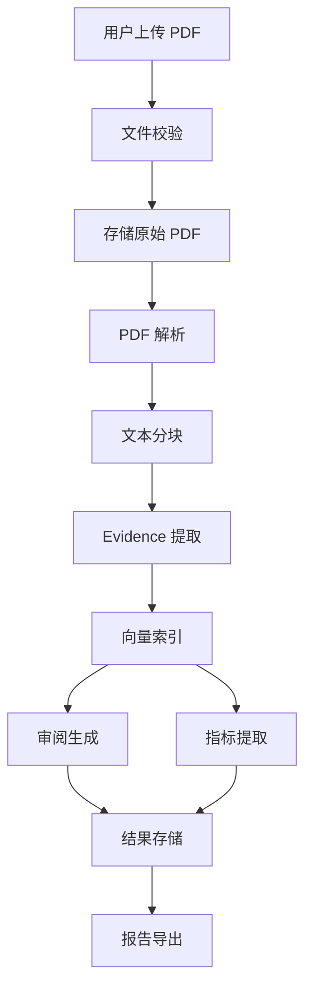

# PaperLens需求规格说明

## 文档信息

- **项目名称**: PaperLens
- **文档版本**: v1.0
- **创建日期**: 2026-07-13
- **最后更新**: 2026-07-13
- **文档状态**: 已批准

## 1. 引言

### 1.1 编写目的

本文档旨在详细描述 PaperLens 的功能需求、非功能需求和约束条件，为系统设计、开发和测试提供依据。

### 1.2 项目背景

学术论文审阅是科研工作的核心环节，但当前面临以下问题：
- 人工审稿耗时，阅读一篇论文并撰写审稿意见通常需要 2-4 小时
- 论文中实验指标常以 final/max/mean/best 等不同口径报告，人工难以快速识别和统一对比
- PDF 中的表格结构复杂，复制粘贴后格式错乱，手工转录易出错
- 论文报告的指标与原始实验日志之间可能存在偏差，缺乏自动化交叉验证手段
- AI 生成的审稿意见常出现幻觉，无法追溯到论文原文，可信度低

PaperLens 旨在通过 AI 辅助论文审阅、指标提取和实验数据交叉验证，解决上述痛点。

### 1.3 术语定义

| 术语 | 定义 |
|------|------|
| Evidence | 原文证据，审阅结论的依据，包含页码、bbox 坐标和字符偏移 |
| ReviewFinding | 审阅发现，每条发现绑定 Evidence，类型为 STRENGTH / WEAKNESS / SUGGESTION |
| Checkpoint Type | 统计口径，如 FINAL / MAX / MEAN / BEST / LAST |
| PaperChunk | 文本分块，用于向量索引和证据检索 |
| page-local | 页内定位，Evidence 不涉及跨页 span |

### 1.4 参考资料

- docs/architecture.md — 架构设计文档
- docs/data-model.md — 数据模型设计
- docs/api-contract.md — REST API 契约
- docs/security-design.md — 安全设计文档

## 2. 系统概述

### 2.1 系统目标

通过开发 PaperLens，实现：
- AI 辅助论文审阅，每条结论绑定原文 Evidence，消除幻觉
- 自动从论文表格和正文中提取实验指标，识别统计口径
- 实验数据文件（CSV/Excel）与论文指标交叉验证，标记偏差
- 审阅报告多格式导出（Markdown / PDF / DOCX）

### 2.2 用户特征

| 用户角色 | 描述 | 技术水平 | 使用频率 |
|----------|------|----------|----------|
| 研究者（Researcher） | 需要审阅论文、提取实验指标、对比实验结果的科研人员 | 高 | 每天 |
| 审稿人（Reviewer） | 需要快速生成结构化审稿意见的学术审稿人 | 中-高 | 每周 |
| 实验分析师（Analyst） | 需要从论文和实验数据中提取、汇总、对比指标的数据分析人员 | 中 | 每周 |

### 2.3 运行环境

**硬件环境**:
- 服务器: 华为云 ECS（后端服务）+ RDS（PostgreSQL）+ OBS（文件存储）+ ModelArts（LLM 推理）
- 客户端: 现代 Web 浏览器

**软件环境**:
- 操作系统: Linux（ECS）/ macOS / Windows（本地开发）
- 数据库: PostgreSQL 15+
- Web服务器: Uvicorn（ASGI）+ Nginx（静态托管）
- 浏览器: Chrome / Firefox / Edge / Safari 最新版本

## 3. 功能需求

### 3.1 论文上传与解析(F01-F04)

#### F01 论文上传

**需求描述**: 支持 PDF 文件上传（multipart 流式上传），文件类型校验，大小限制 50MB。

**功能要求**:
- FR01.1: 支持单文件 PDF 上传（multipart/form-data）
- FR01.2: 文件类型校验（仅接受包含可提取文本的 PDF）
- FR01.3: 文件大小限制 50MB
- FR01.4: 路径穿越防护
- FR01.5: SHA-256 文件哈希计算与存储（去重/复用逻辑 📋 PLANNED）
- FR01.6: 上传后自动触发后台解析任务

**输入**:
- PDF 文件（必填）
- 论文标题参数（📋 PLANNED；当前接口不接收 title，标题由清洗后的文件名 stem 生成）

**输出**:
- 论文 ID、标题、文件名、状态（PROCESSING）

**验收标准**:
- [x] PDF 文件可成功上传
- [x] 非 PDF 文件返回 415 错误
- [x] 超过 50MB 返回 413 错误
- [x] 上传后状态为 PROCESSING，并注册后台解析任务

#### F02 PDF 解析

**需求描述**: 提取文本、页面信息，识别章节结构。

**功能要求**:
- FR02.1: 使用 PyMuPDF + pdfplumber 提取页面文本
- FR02.2: 生成 normalized_text_content（空白字符合并）
- FR02.3: 识别章节结构（ABSTRACT / INTRODUCTION / METHOD 等）
- FR02.4: 提取页面尺寸（width / height）
- FR02.5: 仅支持包含可提取文本的 PDF

**验收标准**:
- [x] 上传 PDF 后状态变为 PARSED
- [x] 页面文本和章节结构可查询
- [x] 解析失败状态变为 FAILED，含 error_message

#### F03 表格提取

**需求描述**: 从 PDF 中提取表格并结构化存储。

**功能要求**:
- FR03.1: 使用 pdfplumber 提取表格
- FR03.2: 存储为 structured_data（JSONB）和 raw_text（兜底）
- FR03.3: 记录表格 bbox 坐标和 caption
- FR03.4: 非法表格（page_number=0）使用 SAVEPOINT 降级跳过

**验收标准**:
- [x] 表格可提取并结构化存储
- [x] 非法表格不影响论文整体解析状态

#### F04 文本分块

**需求描述**: 按语义段落/章节对论文文本进行分块。

**功能要求**:
- FR04.1: 按章节/段落分块，生成 PaperChunk 记录
- FR04.2: 记录块序号、字符数、涉及页码
- FR04.3: 预留 embedding_id 字段（向量索引 ID）

**验收标准**:
- [x] 文本分块可查询
- [x] 每个块关联所属章节

### 3.2 证据与审阅(F05-F07)

#### F05 向量索引

**需求描述**: 对文本块进行 Embedding 并建立向量索引。

**功能要求**:
- FR05.1: 调用 Embedding 模型向量化 PaperChunk
- FR05.2: 使用 FAISS 建立向量索引
- FR05.3: 索引可序列化持久化

**验收标准**:
- [ ] PaperChunk 可向量化并建立持久化索引（未实现；P3.2 仅对 Evidence 做任务内即时向量化，不回填 embedding_id）

#### F06 原文证据检索

**需求描述**: 基于问题/关键词检索相关文本块，返回 Evidence（含 PDF 精确定位）。

**功能要求**:
- FR06.1: Evidence 为 page-local 定位，基于 PyMuPDF block 提取
- FR06.2: 使用真实 bbox 坐标和字符偏移（char_start / char_end）
- FR06.3: 支持 TEXT / TABLE / FIGURE_CAPTION / EQUATION 类型
- FR06.4: 前端基于 normalized_text_content 字符区间高亮

**验收标准**:
- [x] Evidence 可提取并查询（page-local, real bbox）
- [x] 前端可高亮跳转到 Evidence 位置
- [x] P3.2 审阅任务按维度对同论文 Evidence 执行即时 Embedding、精确余弦排序和 Top-K 检索
- [ ] 基于持久化 FAISS/pgvector 索引的通用语义检索 API

#### F07 结构化论文审阅

**需求描述**: 生成包含优缺点、改进建议的审阅结果，每条 Finding 绑定 Evidence。

**功能要求**:
- FR07.1: 按维度生成审阅结果（SOUNDNESS / NOVELTY / CLARITY 等）
- FR07.2: 每条 ReviewFinding 必须关联至少一个 Evidence
- FR07.3: 未关联 Evidence 的 Finding 标记为 UNVERIFIED，不展示给用户
- FR07.4: 支持 STRENGTH / WEAKNESS / SUGGESTION 类型
- FR07.5: 评分 1-5，含 overall_verdict

**验收标准**:
- [x] P3.1 审阅任务与结果 API 返回含 VERIFIED Evidence 绑定的结构化 Mock 结果
- [x] 无法完整绑定的 Finding 标记为 UNVERIFIED 且公开接口不展示
- [x] P3.2 语义 Evidence 检索
- [x] P3.3 HuaweiMaaSLLMClient（华为云 MaaS 标准 API V2 非流式适配器；默认仍为 Mock）
- [x] P3.4 审阅结果前端：任务创建/恢复/轮询、按最新有结果 task_id 归组、Finding 筛选和 Evidence 深链

### 3.3 指标提取(F08-F09)

#### F08 实验指标提取

**需求描述**: 从表格和正文中提取实验指标，记录指标名、值、数据集、模型名。

**功能要求**:
- FR08.1: 从 PaperTable 的 structured_data 中提取指标
- FR08.2: 记录模型名、数据集名、指标名、指标值
- FR08.3: 关联来源 Evidence 和表格行号

**验收标准**:
- [ ] 指标记录 API 返回结构化数据（未实现）

#### F09 Checkpoint 口径判断

**需求描述**: 识别 final/max/mean/best 等统计口径并标注。

**功能要求**:
- FR09.1: 基于规则引擎判断 checkpoint_type（关键词匹配 + 上下文分析）
- FR09.2: 标注口径来源（EXPLICIT_TEXT / IMPLICIT_CONTEXT / TABLE_HEADER / UNKNOWN）
- FR09.3: LLM 仅辅助歧义消解，不参与数值计算

**验收标准**:
- [ ] 指标记录含 checkpoint_type 和 checkpoint_source（未实现）

### 3.4 实验数据分析(F11-F12)

#### F11 CSV/Excel 实验数据分析

**需求描述**: P5.1 安全上传 CSV/XLSX/XLS 并生成可信结构元数据；P5.2 已实现确定性统计摘要任务与结果 API。

**功能要求**:
- FR11.1: 支持 CSV / XLSX / XLS 文件上传（最大 20MB）
- FR11.2: 使用只接收服务端路径和确认类型的确定性解析器识别列结构
- FR11.3: 使用确定性 Python 代码计算统计摘要（mean、std、min、max、median）
- FR11.4: LLM 不参与任何数值计算

**验收标准**:
- [x] P5.1 文件可安全上传并生成 version=1 `columns_info`
- [x] 认证隔离、幂等并发和失败补偿通过 PostgreSQL 集成测试
- [x] P5.2 统计摘要由确定性代码计算，文件完整性复核且结果原子写入

#### F12 指标交叉验证

**需求描述**: 对比论文报告指标与实验数据文件中的指标，标记偏差。

**功能要求**:
- FR12.1: 匹配论文 MetricRecord 与实验数据中的指标
- FR12.2: 计算偏差值（diff）
- FR12.3: 标记验证状态（MATCH / MISMATCH）

**验收标准**:
- [ ] 交叉验证结果可查询（未实现）

### 3.5 报告导出(F10, F13)

#### F10 审稿报告导出

**需求描述**: 导出 Markdown 格式的审稿报告。

**功能要求**:
- FR10.1: 生成包含审阅结果、指标记录的报告
- FR10.2: 支持 Markdown 格式导出
- FR10.3: 支持中英文语言选择
- FR10.4: 支持可选包含指标记录和实验分析
- FR10.5: 报告内容确定性，创建时快照数据源
- FR10.6: 相同活跃参数的导出请求幂等去重

**验收标准**:
- [x] P6.1 Markdown 报告可创建、轮询状态和下载
- [x] 支持 zh/en 双语模板
- [x] 可选包含指标表格和实验分析（含统计摘要与交叉验证比较）
- [x] HTML/Markdown 特殊字符严格转义
- [x] source_snapshot 快照保证内容确定性
- [x] PDF/DOCX 格式导出（P6.2）
- [x] 报告导出前端页面、历史分页、轮询与安全下载（P6.2）

#### F13 PDF/DOCX 报告导出

**需求描述**: 支持导出为 PDF 和 DOCX 格式。

**功能要求**:
- FR13.1: 支持 PDF 格式导出
- FR13.2: 支持 DOCX 格式导出
- FR13.3: PDF 中英文文本可选择、可提取且字节确定
- FR13.4: DOCX 可重开、字节确定且无宏/OLE/外部关系
- FR13.5: 当前论文导出历史严格分页并隔离跨用户访问

**验收标准**:
- [x] 多格式报告可生成、查询历史并安全下载（P6.2）

### 3.6 用户与管理员系统(F21-F22)

#### F21 用户账号与权限

**需求描述**：使用真实用户身份替换当前 `demo_user_id`，为所有业务资源建立可靠的认证、授权和归属边界。

**功能要求**：
- FR21.1：支持用户名/邮箱唯一校验的注册、登录和安全退出
- FR21.2：支持短时访问令牌、刷新令牌轮换、撤销和会话管理
- FR21.3：支持密码修改、忘记密码/重置密码和个人资料维护
- FR21.4：支持账号启用、禁用、锁定和登录失败防护
- FR21.5：支持 USER/ADMIN RBAC，业务资源 user_id 只取自认证上下文

**验收标准**：
- [ ] 注册、登录、刷新、退出、密码和个人资料流程完整通过
- [x] 普通用户不能访问其他用户业务资源；管理员业务资源 API 仍待 P7
- [ ] 注销/撤销/禁用后旧令牌不能继续访问

#### F22 管理员系统

**需求描述**：提供独立的管理员 API 和管理后台，支持平台运营、异常处置和安全审计。

**功能要求**：
- FR22.1：管理仪表盘展示用户、论文、任务、审阅和报告运行概况
- FR22.2：支持用户查询、角色调整、启用/禁用和受控密码重置
- FR22.3：支持论文、任务、审阅和报告的查询与受控管理操作
- FR22.4：管理员敏感操作记录操作者、目标、时间、结果和必要上下文
- FR22.5：禁止删除/降级最后一个有效管理员；首个管理员通过受控初始化流程创建

**验收标准**：
- [ ] 普通用户访问管理员 API/页面稳定返回 403 或跳转
- [ ] 管理员核心操作可用且审计记录完整
- [ ] 不存在硬编码默认管理员账号或密码

## 4. 非功能需求

### 4.1 性能需求

| 性能指标 | 要求 | 说明 |
|----------|------|------|
| PDF 解析时间 | < 30 秒 | 单篇论文解析时间 |
| Evidence 检索时间 | < 2 秒 | Top-K 语义检索 |
| API 响应时间 | < 500ms | 常规查询响应 |
| 文件上传限制 | 50MB (PDF) / 20MB (CSV/Excel) | 最大文件大小 |

### 4.2 安全需求

**文件安全**:
- 文件类型验证（仅 PDF / CSV / XLSX / XLS）
- 文件大小限制
- 路径穿越防护
- 文件名安全处理

**数据安全**:
- 用户数据隔离（不同用户的论文和审阅结果严格隔离）
- HTTPS 传输加密（云端部署）
- SQL 注入防护（ORM 参数化查询）
- 错误信息不泄露内部异常（_safe_error_message()）

**认证安全**:
- Bearer JWT access + 可撤销 AuthSession（✅ P3.5 CURRENT）
- 密码使用 Argon2id、bcrypt 或等价可靠自适应哈希，禁止明文和可逆加密
- 访问令牌短时有效；刷新令牌轮换、可撤销且服务端保存安全摘要
- 登录、注册和密码重置具备限流、失败锁定与防账号枚举错误信息
- USER/ADMIN 权限在服务端逐接口校验，前端路由守卫不能替代后端授权
- 管理员敏感操作必须写审计日志，禁止硬编码默认管理员凭据
- 华为云 IAM 用于云资源身份，不代替 PaperLens 产品用户系统

### 4.3 可用性需求

**用户体验**:
- 论文上传后自动解析，无需手动触发
- Evidence 高亮跳转，精确定位原文
- 后端不可用时显示明确错误提示
- 任务进度通过 HTTP 轮询展示

**易用性**:
- 上传论文仅需选择文件和可选标题
- 审阅结果按维度组织，Finding 绑定 Evidence 可追溯

### 4.4 兼容性需求

**浏览器兼容**:
- Chrome (最新版本)
- Firefox (最新版本)
- Edge (最新版本)
- Safari (最新版本)

**设备兼容**:
- PC端: 完整功能

## 5. 约束条件

### 5.1 技术约束

- 开发语言: Python 3.10+（后端）、TypeScript（前端）
- 开发框架: FastAPI（后端）、Vue3（前端）
- 数据库: PostgreSQL 15+
- ORM: SQLAlchemy 2.x + Alembic
- 部署环境: 华为云 ECS + RDS + OBS + ModelArts

### 5.2 业务约束

- 所有审阅结论必须绑定 Evidence，不允许无依据的结论
- 大模型不直接计算统计数据，所有数值统计由确定性 Python 代码计算
- 仅支持包含可提取文本的 PDF，不支持扫描型 PDF / OCR
- 文件上传使用普通 multipart 流式上传，暂不实现分片上传
- 任务进度通知使用 HTTP 轮询，暂不实现 WebSocket
- 后台任务使用 FastAPI BackgroundTasks（仅 MVP），暂不引入 Celery + Redis

### 5.3 设计约束

- LLM 必须通过统一 LLMClient 接口调用，默认提供 MockLLMClient，并可配置 HuaweiMaaSLLMClient
- 存储层通过 StorageBackend 接口抽象，LocalStorage 为当前实现
- Evidence 采用 page-local 定位，不涉及跨页 span
- 当前审阅检索通过统一 EmbeddingClient 对 Evidence 做任务内精确余弦检索；FAISS/pgvector 持久化索引为后续规划

## 6. 验收标准

### 6.1 功能验收

**已实现（P2.5）**:
- [x] F01 论文上传
- [x] F02 PDF 解析
- [x] F03 表格提取
- [x] F04 文本分块
- [x] F06 Evidence 提取（page-local）

**已实现（P3.1～P3.2）**:
- [x] F07 结构化论文审阅后端基础闭环（MockLLM、严格解析、Evidence 绑定、4 API）
- [x] F06 审阅维度语义 Evidence 检索（Mock/Huawei Embedding 可替换、精确余弦 Top-K）

**待实现**:
- [ ] F05 向量索引（FAISS）
- [ ] F07 真实华为云生成式模型与审阅前端
- [ ] F08 实验指标提取
- [ ] F09 Checkpoint 口径判断
- [x] F10 审稿报告导出（P6.1～P6.2）
- [x] F11/P5.1 CSV/Excel 安全上传与结构解析
- [x] F11/P5.2 统计摘要
- [x] F12/P5.3a 指标交叉验证后端
- [x] F13 PDF/DOCX 报告导出
- [x] F21 用户账号与权限（P3.5）
- [ ] F22 管理员系统

**验收方法**:
- 功能测试（pytest + Vitest）
- Docker 全量测试（0 skipped）
- E2E 回归验证

### 6.2 性能验收

**验收内容**:
- [ ] PDF 解析时间 < 30 秒
- [ ] Evidence 检索时间 < 2 秒
- [ ] API 响应时间 < 500ms

**验收方法**:
- 性能测试
- 压力测试

### 6.3 安全验收

**验收内容**:
- [ ] 文件安全校验通过
- [ ] 用户数据隔离验证通过
- [ ] 错误信息不泄露内部异常
- [ ] 路径穿越防护有效
- [ ] 注册登录、令牌刷新/撤销、密码修改/重置安全通过
- [x] USER/ADMIN 角色基础与跨用户业务资源隔离测试通过；完整管理员 API 越权矩阵待 P7
- [ ] 管理员敏感操作均有完整审计记录

**验收方法**:
- 安全扫描
- 渗透测试
- 开发库隔离验证

## 7. 附录

### 7.1 非目标功能

| 项目 | 说明 |
|------|------|
| 论文自动投稿 | 不涉及投稿流程 |
| 论文写作辅助 | 不涉及论文撰写或润色 |
| 学术搜索引擎 | 不构建论文检索引擎 |
| 实时协作编辑 | 不支持多人实时编辑审阅报告 |
| 论文查重 | 不提供查重服务 |
| 模型训练平台 | 不提供模型训练能力，仅使用 ModelArts 推理接口 |
| 通用文档问答 | 不做通用文档问答，聚焦学术论文审阅场景 |
| 扫描型 PDF / OCR | MVP 仅支持包含可提取文本的 PDF |
| 分片上传 | MVP 使用普通 multipart 流式上传 |

### 7.2 加分功能

| 编号 | 功能 | 描述 |
|------|------|------|
| F14 | 多论文对比审阅 | 同时上传多篇论文，生成对比审阅报告 |
| F15 | 审阅历史管理 | 保存审阅历史，支持回溯和版本对比 |
| F16 | 自定义审阅模板 | 用户可自定义审阅维度和评分标准 |
| F17 | 协作审阅 | 多人共同审阅同一篇论文，合并审阅意见 |
| F18 | 论文相似度检测 | 检测上传论文之间的相似度 |
| F19 | 实验指标趋势图 | 对多组实验数据生成可视化趋势图 |
| F20 | 批量论文处理 | 支持批量上传和批量审阅 |

### 7.3 业务流程图

## 8. P4.1 验收补充

- [x] F08 指标提取后端：规范化、数值解析、表格/Evidence 来源追溯、稳定去重和查询 API。
- [x] F09 Checkpoint 后端：FINAL/MAX/MEAN/BEST/LAST/UNKNOWN，冲突和无证据诚实降级。
- [x] 所有记录使用真实认证用户隔离；ADMIN 不默认越权。
- [x] 后台任务成功原子写入，失败记录为 0；活动任务数据库防重。
- [x] P4.2 指标分析页面和用户端任务交互：成功历史按 `task_id` 隔离，支持创建/恢复/轮询、筛选分页、来源追溯和异步生命周期收口。

---

## P4.3 MaaS 运行配置要求

- FR07.2.1：默认 `mock`，不得因宿主机存在其他 MaaS 变量而自动产生请求。
- FR07.2.2：`huawei_maas` 必须验证 HTTPS base URL、非空 model、非占位 API Key、timeout 与 max tokens。
- FR07.2.3：base URL 不得含 credentials、query、fragment 或末尾 `/chat/completions`。
- FR07.2.4：配置检查不得联网或输出任何 Key 派生信息。
- FR07.2.5：烟测缺少 `--confirm-billable`、backend 错误或配置无效时不得构造 HTTP client。
- FR07.2.6：自动测试只能使用假 client/transport；真实烟测必须由用户手工确认。

## 9. P5.2 统计摘要验收补充

- [x] POST analysis 支持 201 新建和 200 幂等；GET result 返回严格 version=1 摘要。
- [x] 统计逐行读取，非数值列不保存值；数值列使用样本标准差和精确中位数。
- [x] NaN、Infinity、计算溢出和超安全整数失败，不静默转 null、0 或字符串。
- [x] task、file、paper、user 四者同属，跨用户和 ADMIN 他人访问统一 404。
- [x] hash、file_type、row/column 和完整 columns_info 在计算前复核，计算后再次复核 hash。
- [x] P5.3a 指标交叉验证后端与 P5.3b 实验数据前端均已实现并验收。

## 10. P5.3a 交叉验证验收补充

- [x] 名称仅使用 NFKC→casefold→isalnum，禁止语义别名和模糊匹配。
- [x] MEAN/MAX 可比较，BEST/FINAL/LAST/UNKNOWN 统一诚实降级。
- [x] 重复论文指标、无实验列、重复实验列及空规范名均返回固定 UNVERIFIABLE 原因。
- [x] 同源幂等、异源冲突、并发最多写一份；失败不留下部分 JSON。
- [x] 所有任务、结果、文件、论文、用户和指标来源再次联查；ADMIN 不旁路所有权。
- [x] 不读取原文件、原始行或来源正文，不调用 LLM/Embedding，不访问网络。

## 11. P5.3b 实验数据前端验收补充

- [x] 仅 PARSED 且属于当前登录用户的论文可进入实验数据业务流，路由继续受认证守卫保护。
- [x] 上传前检查扩展名、非空和 20MB 上限；浏览器自行生成 multipart boundary，不手写 Content-Type。
- [x] 文件列表分页；选中文件并行加载可信结构详情和已有结果，上传成功后自动选中响应文件。
- [x] 统计任务按 3 秒轮询，响应必须匹配当前 paper/file/task；切换文件、路由或卸载后旧响应不得写回。
- [x] 已有 metric_comparisons 直接恢复并锁定来源，不允许重复 POST 或用另一指标任务覆盖。
- [x] 默认选择最新成功 METRIC_EXTRACTION；没有可用任务时链接到指标页。
- [x] 所有未知服务端错误映射为固定公开文案，不展示原始异常、路径、密钥、令牌或 Authorization。
- [x] 定向前端 48、前端全量 154、构建 129 modules、Docker 后端全量 673 均通过。

## 12. P6.1 Markdown 导出验收补充

- [x] POST /papers/{paper_id}/exports 创建导出报告，支持 report_type=MARKDOWN、language=zh/en、include_metrics 和 include_experiment_analysis 可选参数。
- [x] 相同用户/论文/选项/来源/内容的活跃或 READY 导出幂等返回 200；不同来源新建；FAILED 可重试；非 PARSED 论文 409；跨用户统一 404。
- [x] GET /exports/{export_id} 返回严格公开状态，含 language 和两个 include 选项，但不公开 source_snapshot/source_hash/content_hash/storage_key。
- [x] GET /exports/{export_id}/download 仅 READY 状态返回文件流，其余返回 409 或 404。
- [x] Markdown 生成支持 zh/en 双语模板，包含审阅详情、可选指标表格、可选实验分析（含统计摘要与交叉验证比较）。
- [x] HTML/Markdown 特殊字符严格转义，输出确定性。
- [x] source_snapshot 只记录来源 id；创建 PENDING 前生成确定性 bytes/content_hash/source_hash，后台不重新选择来源。
- [x] 状态机 PENDING → GENERATING → READY 或 FAILED；原子认领、存储回读校验、未归属对象补偿；生成不调用 LLM/Embedding，不访问网络。
- [x] Evidence 输出真实页码与短引用；Review/Metric/Experiment 全来源图异常固定 EXPORT_SOURCE_INVALID 409。
- [x] 72 项生成单元、25 项 API/并发/补偿测试和 1 项迁移测试已通过；后端全量结果见 Sprint。
- [x] 路由总数 30 → 33，业务表仍为既有 18 张，Alembic head 从 009 经 010 升至 011。

## 13. 阅读学习核心需求（2026-07-15 新增）

### FR-13.1 论文阅读工作台（P7.1）

- FR-13.1.1：已登录用户可从自己的 PARSED 论文进入受保护的 `/papers/:id/read`。
- FR-13.1.2：工作台必须同时提供章节目录、正文阅读区和学习助手区，并可切换章节与页面。
- FR-13.1.3：Evidence 引用必须可回到对应页码和原文高亮；定位失败时展示明确降级提示。
- FR-13.1.4：路由、章节、页面、解释任务切换必须隔离旧响应，卸载后停止轮询。

### FR-13.2 证据化学习解释（P7.1）

- FR-13.2.1：支持 SUMMARY、EXPLAIN、TRANSLATE，输出语言仅 zh/en。
- FR-13.2.2：范围仅允许服务端确认的 SECTION、PAGE、EVIDENCE；客户端不得提交任意正文。
- FR-13.2.3：成功结果包含纯文本 answer、有限 key_points、有限 terms 和至少一条真实 Evidence Citation。
- FR-13.2.4：未知/跨论文 Evidence、非法 JSON、超限文本或空引用导致整次任务 FAILED，不公开部分结果。
- FR-13.2.5：同一用户、论文、来源、模式和语言的活动/成功请求可幂等复用；FAILED 可重试。
- FR-13.2.6：默认 Mock 完整可用，Huawei MaaS 复用统一 LLMClient；自动测试禁止真实网络和密钥读取。

### FR-13.3 后续学习闭环

- FR-13.3.1：P7.2 提供论文内多轮问答和证据不足降级。
- FR-13.3.2：P7.3 提供高亮、书签、笔记、知识卡和阅读进度。
- FR-13.3.3：现有结构化审阅作为批判性阅读保留，不再作为产品首页主流程。
- FR-13.3.4：完整管理员系统移至 P8.1 合并交付，仍是发布前必须项。

### FR-13 实现状态

FR-13.1 与 FR-13.2 已在 P7.1 完成并通过 码道独立验收。FR-13.3.1～13.3.2 仍分别留在 P7.2/P7.3；FR-13.3.4 管理员系统仍留在 P8.1，未提前声明完成。

**文档版本**：v1.7
**创建日期**：2026-07-13
**最后更新**：2026-07-15

## FR-14 当前论文多轮问答（P7.2，已实现）

- FR-14.1：用户可为自己已解析论文新建空会话，并分页查看会话元数据与轮次历史。
- FR-14.2：每个会话同一时刻最多一个活动轮次；UUID4 client_request_id 保证重复提交返回同一轮次。
- FR-14.3：服务端对当前论文全部非空 Evidence 做确定性 Top-K 检索，不允许客户端提交正文或跨论文来源。
- FR-14.4：历史上下文只取同会话最近成功轮次，按数量与总字符预算完整丢弃最旧轮次。
- FR-14.5：有依据回答至少一个真实 Citation；证据不足回答零 Citation 且明确降级。
- FR-14.6：模型返回后必须复核会话、论文、历史、候选 Evidence 与 context_hash，变化时不得公开答案。
- FR-14.7：PaperReadingView 提供会话/轮次分页、新建、提问、3 秒串行轮询、失败重新提问和 Citation 原文定位；所有文本安全插值。

验收边界：不含跨论文/联网问答、消息删除/编辑/分享、流式输出、向量库、P7.3 学习沉淀或 P8 管理能力。

## FR-15 个人学习沉淀与论文库（P7.3）

### FR-15.1 论文库管理

- FR-15.1.1：已登录用户可将论文加入个人论文库，设置阅读状态（TO_READ/READING/COMPLETED/ARCHIVED）、收藏标记和自定义集合名。
- FR-15.1.2：论文库列表使用 LEFT JOIN 展示论文元数据与可选的库条目信息，支持按阅读状态、收藏、集合名和标题搜索过滤。
- FR-15.1.3：阅读进度通过串行 PATCH 调用更新 last_page、furthest_page 和 last_read_at，前端保证同一论文同一时刻最多一个在途进度请求。

### FR-15.2 高亮

- FR-15.2.1：用户可在论文页面创建文本高亮，指定页码、字符偏移范围和颜色。
- FR-15.2.2：服务端从 `normalized_text_content` 和客户端提交的偏移量派生 `quoted_text`，并计算 `source_hash` 做防篡校验；客户端不得提交任意引用文本。
- FR-15.2.3：同一用户同一论文同一页码同一字符范围不允许重复高亮。
- FR-15.2.4：被笔记或知识卡引用的高亮不可删除，返回 409 NOTE_OR_CARD_REFERENCES。

### FR-15.3 书签

- FR-15.3.1：用户可为论文页码创建书签，附可选标签。
- FR-15.3.2：同一用户同一论文同一页码不允许重复书签。

### FR-15.4 笔记

- FR-15.4.1：笔记可锚定到页面（PAGE）或高亮（HIGHLIGHT），由 anchor_type 严格互斥。
- FR-15.4.2：anchor_type=PAGE 时只需 page_number；anchor_type=HIGHLIGHT 时需 highlight_id 且该高亮必须属于同一论文。
- FR-15.4.3：笔记内容可创建、查询、更新和删除。

### FR-15.5 知识卡

- FR-15.5.1：知识卡从笔记或高亮二选一创建，由 source_note_id / source_highlight_id 严格互斥。
- FR-15.5.2：知识卡包含 front（正面）、back（背面）、mastery_status（NEW/LEARNING/MASTERED）和 archived 标记。
- FR-15.5.3：知识卡可创建、查询（支持按 mastery_status 和 archived 过滤）、更新和删除。

### FR-15.6 安全与隔离

- FR-15.6.1：所有个人学习数据按 user_id 严格隔离，跨用户统一 404。
- FR-15.6.2：所有服务均为确定性 Python 代码，不调用 LLM/Embedding，不访问网络。
- FR-15.6.3：016 Alembic 迁移新增 5 张表和 4 个枚举；非空表 downgrade 在 DDL 前无损中止。

实现状态：FR-15.1～15.6 已完成并通过 码道独立验收。实际为 59 条 API、27 张 ORM 应用表、后端 977 passed、前端 197 passed、构建 136 modules；下一固定轮次为 P8.1 管理员系统。

## FR-16 完整管理员系统与不可变审计（P8.1）

### FR-16.1 管理仪表盘

- FR-16.1.1：管理员可查看平台运行概况，包括用户数、论文数、任务数、审阅数、报告数和最近审计条目。
- FR-16.1.2：仪表盘数据为实时聚合查询，不缓存、不写入业务表。

### FR-16.2 用户管理与角色/状态变更

- FR-16.2.1：管理员可查询全部用户列表，支持按角色、状态和搜索词过滤。
- FR-16.2.2：管理员可变更用户角色（USER↔ADMIN）和账号状态（ACTIVE↔DISABLED），变更必须填写 reason（8～500 字符，不含控制字符）。
- FR-16.2.3：并发降级或禁用导致零 ACTIVE ADMIN 时返回 409，系统始终保留至少一个 ACTIVE ADMIN。
- FR-16.2.4：相同值变更为 no-op，不写入审计日志，直接返回 200。
- FR-16.2.5：角色/状态变更与受影响用户的会话撤销在同一事务内完成。

### FR-16.3 跨用户只读治理

- FR-16.3.1：管理员可跨用户只读查询论文、任务和报告列表，使用列投影仅返回管理员可见字段。
- FR-16.3.2：跨用户查询不返回 storage_key、file_hash、source_snapshot、content_hash 等内部字段。

### FR-16.4 不可变审计日志

- FR-16.4.1：管理员角色/状态变更和首个管理员创建必须写入 append-only 审计日志，记录操作者、动作、目标、原因和 before/after 状态。
- FR-16.4.2：审计日志在数据库层通过 PostgreSQL trigger 拒绝 UPDATE 和 DELETE，应用层和数据库层双重保证不可变性。
- FR-16.4.3：before_state 和 after_state 仅记录 role 和 status 变更，不记录密码、令牌或其他敏感字段。
- FR-16.4.4：管理员可分页查询审计日志，支持按 action、actor 和 resource 过滤。

### FR-16.5 管理员初始化

- FR-16.5.1：首个管理员通过 `python -m paperlens.cli admin-bootstrap` CLI 创建，仅在零 ACTIVE ADMIN 时允许执行。
- FR-16.5.2：禁止硬编码默认管理员账号或密码。

### FR-16.6 安全与隔离

- FR-16.6.1：所有管理员 API 要求 ADMIN 角色，普通用户访问稳定返回 403。
- FR-16.6.2：017 Alembic 迁移新增 admin_audit_logs 表和 PostgreSQL trigger；非空审计行 downgrade 在 DDL 前无损中止。
